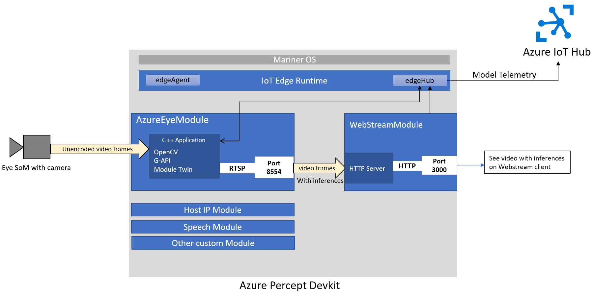

# Azure Percept Workload for Azure Percept Gen 1 Development Kit

**Please note!** The experiences in this repository should be considered to be in **preview/beta**.
Significant portions of these experiences are subject to change without warning. **No part of this code should be considered stable**.

## Table of Contents

1. [Prerequisites](#some-prerequisites)
1. [Architecture](#architecture)
1. [Module Twin Values](#module-twin-values)
1. [Code Flow](#code-flow)
1. [Building](#building)
1. [Running](#running)
1. [Debugging a Running Container](#debugging-a-running-container)
1. [Extending and Customizing](#extending-and-customizing)
1. [The Dockerfile](#the-dockerfile)

## Some Prerequisites

If you want to build custom modules or to customize the current azureeyemodule, you will want to set up a development environment
and keep a few things in mind.

First, you will definitely want SSH access to your device. You can do this via the Out Of Box Experience (OOBE).

Next, you will want to make sure to grant yourself access to the Docker daemon without having to use sudo all the time:
**Note**: These steps impact the security of your device (see [here](https://docs.docker.com/engine/security/#docker-daemon-attack-surface)),
but for development purposes, this is probably fine.

1. SSH onto your device. The rest of these commands will be run on your device.
1. `sudo groupadd docker` to add the docker group to your system.
1. `sudo usermod -aG docker $USER` to add yourself to the new docker group.
1. You can now exit SSH, and the next time you log in with SSH, your account will have the ability to manipulate docker without sudo.

Something to keep in mind while working with Docker images is that the device will fill up with them periodically.
Run `docker image list` to see all the images, and `docker rmi <image-hash>` to remove one. You'll need to do this periodically.
Use `df -h` to check the space on your device. If your /var partition is full, you will want to do this.

## Architecture

### Overview


The Percept Workload on the Azure Percept is a C++ application that runs inside a Docker container, which itself runs on
[Mariner OS](https://github.com/microsoft/CBL-Mariner) as part of the Azure IoT suite of modules running on the Azure Percept device.

The Workload is meant to take in images and output images and messages. The output images may be marked up with drawings such as bounding boxes,
segmentation masks, joints, labels, etc. The output messages are a JSON stream of inference results that can be ingested and used by downstream tasks.

The results are served up as an RTSP stream that is available on port 8554 of the device. The results are also shipped over to another module running on
the device which serves the RTSP stream wrapped in an HTTP server, running on port 3000. Either way, these will be viewable only on the local network.

**Please Note** There is *no* encryption or authentication with respect to the RTSP feeds. Anyone on the local network can view
exactly what the Eye is seeing by typing in the correct address into a web browser or RTSP media player (such as VLC).
**You can disable the RTSP streams** by setting your device's azureeyemodule's module twin in the Azure Portal appropriately.
See the section on Module Twin Values below.

The Workload enables several features that end-users can take advantage of:

* A no-code solution for common computer vision use cases, such as object classification, common object detection, etc.
* An advanced solution, where a developer can bring their own (potentially cascaded) trained model to the device and run it, possibly passing results
  to another IoT module of their own creation running on the device.
* A retraining loop for grabbing images from the device periodically, retraining the model in the cloud, and then pushing the newly trained model
  back down to the device using the device's ability to update and swap models on the fly.

### Details

The Workload application is made up of many small C++ modules, with some of the more important being:

* **main.cpp**: Sets everything up and then runs the main loop.
* **iot**: This folder contains modules which handle incoming and outgoing messages from the Azure IoT Edge Hub, as well as the twin update method.
* **model**: This folder contains modules for a class hierarchy of computer vision models.
* **kernels**: This folder contains modules for G-API kernels, ops, and C++ wrapper functions.

### Model class hierarchy

The Workload application is responsible for loading in a neural network model (or models, in the case of a cascade),
and running it (them) on the input images. The computer vision models that we currently support by default are found in the hierarchy
in the `model` folder.

The hierarchy is composed of `AzureEyeModel` at the very top, which is an abstract base class, `ObjectDetector`,
which is directly under `AzureEyeModel` and which serves as a super class for the specific object detection models
we currently support, and several models which inherit directly from `AzureEyeModel`.

```
                                         AzureEyeModel
                                              +
                                 +------------+-------------------+-------------+-------------+
                                 +                                |             |             |
                           ObjectDetector                         |             |             |
       +---------------+------------+------------+                |             |             |
       +               +            +            +                +             +             +
FasterRCNNModel     SSDModel     YoloModel    S1Model       OpenPoseModel    OCRModel  BinaryUnetModel
```

Each of the concrete classes in this hierarchy supports one or more actual neural networks.

These model classes are responsible for constructing the G-API graph, running it potentially forever, and interpreting
the results of their G-API outputs, typically by constructing messages to be sent over the `send_messages` interface and by
overlaying information on top of the input images and sending these images over the RTSP interface.

The classes that can be instantiated (because they provide an implementation of `AzureEyeModel`'s abstract `run()` method)
are:

* `BinaryUnetModel`: This model is used for binary semantic segmentation tasks.
* `ClassificationModel`: This model supports Microsoft Custom Vision's basic image classification network.
* `FasterRCNNModel`: This model supports any [Faster RCNN](https://arxiv.org/abs/1506.01497) variant which has been converted to OpenVINO and has
  an output dimensionality of `{1, 1, N, 7}`.
* `OCRModel`: This is a cascaded model (two models that run in the same G-API graph) which does optical character recognition.
* `OpenPoseModel`: This model supports [OpenVINO's implementation of the OpenPose pose detection model](https://docs.openvinotoolkit.org/2020.4/omz_models_intel_human_pose_estimation_0001_description_human_pose_estimation_0001.html).
* `S1Model`: This model supports Microsoft Custom Vision's object detection network.
* `SSDModel`: This model supports any [SSD](https://arxiv.org/abs/1512.02325) variant which has been converted to OpenVINO and has as output format
  dimensionality of `{1, 1, N, 7}` where `N` is the maximum number of bounding box proposals, and 7 is the length of the vector of
  `{image_id, label, confidence, x_min, y_min, x_max, y_max}`, which encodes the proposal.
* `YOLOModel`: This model supports any [YOLOv2 or Tiny YOLOv2](https://arxiv.org/abs/1612.08242) variant which has been converted to OpenVINO and has
  an output dimensionality of `{1, 13, 13, 5 * (5 + N)}`, where the network utilizes a grid of shape 13x13 and there are `N` classes.

## Module Twin Values

These are the allowed values for this IoT Module's twin:

* `Logging`: Boolean. Enables/disables debug logging.
* `RetrainingDataCollectionEnabled`: Boolean. If this is set to true, we save images from the camera for retraining purposes.
* `RetrainingDataCollectionInterval`: Integer. Controls how often we save an image if `RetrainingDataCollectionEnabled` is set to true. Units are seconds.
* `ModelZipUrl`: String. Must be a valid URL from which we can download a model. The model must be stored as a .zip file, and the .zip file must
  include either a `config.json` file, a `cvexport.manifest` file, or a `model.blob` file. If the .zip file contains a `config.json`,
  the config file must have a `ModelFileName` key, whose value should be the name of the model file (and that file must be in the .zip archive).
  It must also have a `DomainType` key, whose value should be the `--parser` option you would pass in for this type of model via command line.
  It may have a `LabelFileName` key, in which case the value should be a file name of a text file in the .zip archive which contains a single label
  per line. The model file in the .zip archive should be either a .xml file, in which case a .bin file with exactly the same name (other than the extension)
  should be present as well, as per the OpenVINO IR specification. If the model file is a .blob file, it should have been created using the particular OpenVINO
  that is supported for the device. Lastly, the file could be a .onnx file.
* `SCZ_MODEL_NAME`: String. Protected AI model name.
* `SCZ_MODEL_VERSION`: String. Protected AI model version.
* `SCZ_MM_SERVER_URL`: String. Protected AI server URL.
* `DownloadSecuredModelFromMMServer`: Boolean. If this is false and `SecureAILifecycleEnabled` is true, we use `ModelZipUrl` for our
  model location. If `SecureAILifecycleEnabled` is false, we ignore this value, and if `SecureAILifecycleEnabled` is set to true, and this
  value is set to true, we assume that `SCZ_MM_SERVER_URL` is a valid model management server, and we try to get the model from there.
* `SecureAILifecycleEnabled`: Boolean. Enables/disables Azure Percept Model Management. Note that the protect AI fields will
  ignore the `ModelZipUrl` value unless `DownloadSecuredModelFromMMServer` is set to false, in which case we assume that `ModelZipUrl` contains
  an encrypted model.zip.
* `RawStream`: Boolean. Enables/disables streaming the raw camera feed.
* `ResultStream`: Boolean. Enables/disables streaming the result feed, which will be the raw camera feed plus
  any markups done by the neural network post-processing.
* `H264Stream`: Boolean. Enables/disables the H.264-encoded raw camera feed.
* `StreamFPS`: Integer. The desired frames per second of the camera feed.
* `StreamResolution`: String. Must be one of `native`, `1080p`, or `720p`. Sets the resolution of the camera feed.
* `TelemetryIntervalNeuralNetworkMs`: Integer. Determines how often to send messages from the neural network. Sends a message at most once every this
  many milliseconds. Please note that Azure subscriptions have a limited number of messages per day (depending on the subscription tier).
* `TimeAlignRTSP`: Boolean. If true, we will align the RTSP raw frames with the RTSP result frames. This will cause a latency in the stream
  equal to the amount of time it takes for your neural network to inference each frame. If false, there is no latency, but the results
  for a frame may be written on top of frames that are farther ahead in time, leading to a noticeable lag in the results on the RTSP stream overlay.
  This will be especially noticeable with long-latency networks, such as Faster RCNN.

## Code Flow

The program starts when the device boots, as a result of systemd starting the IoT Edge Agent module, which in turn starts all the IoT modules,
including this one. Like the other IoT modules, this one runs as a Docker container.

The Docker container starts the app with some default command line arguments.

`Main.cpp` proceeds to set everything up and then loads the model that has been passed in from the command line (or the default model, SSD, if none has
been given via command line). Once this model has been loaded, it runs it by calling the model's `run()` method, which should only
return if the model has been told to update the model binary or camera resolution by the `iot_update` interface.

If the `run()` method returns, we destroy the old model and create a new one based on the information given to us via the `iot_update` interface.

It is up to the particular model class to decide what its `run()` method should do, but typically they construct a G-API graph, loading in the VPU back-end,
then pull data through the G-API graph until the model is told to exit for an update.

When the model's G-API graph outputs neural network inferences, it typically handles it by sending messages and overlaying information on the input images.
The model also handles the RTSP feed and retraining loop, though these have default implementations that most models can take advantage of.

### Model Updates

A particularly hairy bit of logic occurs around the model update mechanism. The gist of it can be seen from this (sweet awesome ASCII art) flow chart:

```
                                                        +--------------------+
                                                        | Module Twin Changes|
                                                        +--------+-----------+
                                                                 |
                                                        +--------v-----------+
                                                        | Any model config   |
                                                        | is changed         |
                                                        +--------+-----------+
                                                                 |
                      +----------------------------+ Y  +--------v-----------+   N    +-----------------------+
                      | Start protected           <-----+ Model is protected?+-------->  Start normal model   |
                      | model download process     |    +--------------------+        |  download process     |
                      +------------+---------------+                                  +---------+-------------+
                                   |                                                            |
                                   |                                                            |
                      +------------v---------------+                                  +---------v-------------+
                 Y    | Model is downloaded from   |   N                              |Download model package |
             +--------+ MM server?                 +--------+                         |from ModelZipUrl       |
             |        |                            |        |                         +---------+-------------+
             |        +----------------------------+        |                                   |
             |                                              |                                   |
             |                                              |                                   |
             |                                              |                                   |
             |                                              |                                   |
+------------v---------------+                   +----------v------------+                      |
| Download model package and |                   |Download model package |                      |
| decrypt it with protected  |                   |from ModelZipUrl       |                      |
| AI lifecycle APIs          |                   +----------+------------+                      |
+------------+---------------+                              |                                   |
             |                                              |                                   |
             |                                   +----------v-------------+                     |
             |                                   |Decrypt model package   |                     |
             |                                   |with Azure Percept      |                     |
             |                                   |MM SDK APIs             |                     |
             |                                   +----------+-------------+                     |
             |                                              |                                   |
             |                                              |                                   |
             |                                              |                                   |
             |                              +---------------v-----------------+                 |
             +------------------------------>      Extract model package      <-----------------+
                                            +---------------+-----------------+
                                                            |
                                                            |
                                                    +-------v-------+
                                                    |Apply the model|
                                                    +---------------+

```

## Building

Building the Percept app can be accomplished in at least two ways, and the following sections outline the details.

### Native

One way to build and test is to build natively on the device.
If you have a device and have set up a user on it via the Out Of Box Experience (OOBE), you can use SCP to copy the new source code over to it,
then you can use SSH to connect to the device, stop the IoT modules, restart the Docker image, and compile the new version of the Percept app
inside it.

To do this, assuming you have SCP and SSH on your computer, you can use the following instructions:

1. From this directory, `scp -r app <user>@<dev-ip>:~/tmp`
1. `ssh <user>@<dev-ip>` The following lines are executed on the device.
1. `sudo systemctl stop iotedge` to stop the iotedge daemon (otherwise it will keep restarting the IoT modules)
1. or, in case you are just running the azureeyemodule `docker stop azureeyemodule` to stop the running instance.
1. Now run the Docker container like this:
    ```
    docker run --rm \
                -v /dev/bus/usb:/dev/bus/usb \
                -v ~/tmp:/tmp \
                -w / \
                -it \
                --device-cgroup-rule='c 189:* rmw' \
                -p 8554:8554 \
                mcr.microsoft.com/azureedgedevices/azureeyemodule:preload-devkit /bin/bash
    ```

Once inside the Docker container, run the following commands:

1. `cd /tmp`
1. `mkdir build`
1. `cd build`
1. `cmake -DOpenCV_DIR=/eyesom/build/install/lib64/cmake/opencv4 -DmxIf_DIR=/eyesom/mxif/install/share/mxIf -DCMAKE_PREFIX_PATH=/onnxruntime/install/lib64 ..`
1. `make`

You may now test the new source code by executing: `./inference` from the build directory, passing in whatever args you want.

This is a lot of steps, and if you find yourself doing this often, I highly recommend that you write yourself a script
to automate it (and feel free to open a pull request for us to include it!).

### Cross Compiling

Building on the device is fine, but it is also not ideal. The device is not meant to be compiling source code - it is
meant to be running the azureeyemodule and supporting infrastructure. Compiling the source code currently works,
but it may not in the future. If the app gets too much bigger, it may not be possible to compile it on the device due to its limited CPU bandwidth and RAM.

That's where cross compiling comes in. If you'd like to cross compile the azureeyemodule, follow the instructions in this section.

#### Windows

First, you will need to enable multiarch ("buildx") support in your Docker version. If you are using Docker for Windows,
[it is easy](https://docs.docker.com/buildx/working-with-buildx/), but if you are using Linux, things get a bit trickier.

#### Linux

For Linux, you can visit [this webpage](https://www.docker.com/blog/getting-started-with-docker-for-arm-on-linux/) to see the most
up to date instructions for installing buildx on Linux, but for me at least, it as as simple as:

```
export DOCKER_BUILDKIT=1
docker build --platform=local -o . git://github.com/docker/buildx
mkdir -p ~/.docker/cli-plugins
mv buildx ~/.docker/cli-plugins/docker-buildx
```

Then you need to run the following command to enable QEMU:

```
docker run --rm --privileged docker/binfmt:a7996909642ee92942dcd6cff44b9b95f08dad64
```

This does not persist over reboots, so it will need to be rerun every time you reboot your machine and want to cross compile.
Again, this is just for Linux machines.

Finally, Linux users must follow these steps to create a new builder instance:

```
docker buildx create --name azure-eye-xc
docker buildx use azure-eye-xc
docker buildx inspect --bootstrap
```

#### Windows

Either way, once you have buildx installed, run the following to cross compile:

`docker buildx build --platform linux/arm64 --tag azureeyemodule-xc -f Dockerfile.arm64v8 --load .`, which will build the azureeyemodule Docker image,
and with it, the Percept application.

Append `--build-arg BUILD_TYPE=Release` for a release build instead of the default Debug build.

Once you have your new azureeyemodule, stick it into any container registry and pull it using the module twin.
Alternatively, you can [tar up your image and scp it over](https://stackoverflow.com/questions/23935141/how-to-copy-docker-images-from-one-host-to-another-without-using-a-repository).

#### Linux

Unfortunately, in Linux, there doesn't seem to be a way to do the whole build locally. You have to push the base image up to a registry,
then pull it during the second step.

`docker buildx build --platform linux/arm64 --tag azureeyemodule-xc -f Dockerfile.arm64v8 .`, which will pull the base image and build the
azureeyemodule Docker image on top of it.

Append `--build-arg BUILD_TYPE=Release` for a release build instead of the default Debug build.

Once you have your new azureeyemodule, stick it into any container registry and pull it using the module twin.
Alternatively, you can [tar up your image and scp it over](https://stackoverflow.com/questions/23935141/how-to-copy-docker-images-from-one-host-to-another-without-using-a-repository).

## Running

The device is meant to run in an embedded context, which is to say that it is not meant to be used as a general compute device - instead,
the IoT modules start up as part of the boot process, and the Percept workload runs inside that context.

After OOBE, the device will run the `preload-devkit` tag of the azureeyemodule Docker image from Microsoft Container Registry.
This image should support most use cases for an end-user, however, the end-user is also allowed to modify the Percept workload application and even add additional
modules to the IoT system.

This section describes how to run a custom version of the Percept application.

### Debugging

For debugging, it is easiest to simply kill the edgeAgent daemon that is running on the device along with the current azureeyemodule instance.
Once that's done, you can compile the new app using whatever means you have chosen from the compilation section and then
you can run the new version.

Briefly, the steps are:

1. `ssh <username>@<device-ip>`
1. `sudo systemctl stop iotedge` to stop the iotedge daemon
1. or, if you are only running azureeyemodule, `docker stop azureeyemodule` to stop the running instance of the Azure Eye Module

The next step depends on how you've built your new version of the app.

#### Native

If you have built the app natively on the device, you already have everything you need. If you kill the Docker container that
was used to compile the app, you can get it back (along with the already-built app) by running (assuming you followed the previous instructions
for building on the device):

```
docker run --rm \
            -v /dev/bus/usb:/dev/bus/usb \
            -v ~/tmp:/tmp \
            -w / \
            -it \
            --device-cgroup-rule='c 189:* rmw' \
            -p 8554:8554 \
            azureedgedevices.azurecr.io/azureeyemodule:preload-devkit /bin/bash
```

This command will drop you into the container and the previously built app should be in `/tmp/build`.

#### Cross Compiled

If you cross compiled the image and copied it to the device, you can simply run the new image with

```
docker run --rm \
            -v /dev/bus/usb:/dev/bus/usb \
            -w / \
            -t \
            --device-cgroup-rule='c 189:* rmw' \
            -p 8554:8554 \
            azureeyemodule-xc #<--- this needs to be pulled from wherever you are storing it
```

### Running alongside the rest of the IoT modules

Killing the iotedge daemon stops all the IoT modules. This will prevent many of the features from
working, including viewing the device stream on port 3000, for example.

One way to run all the modules, including the new module, on the device is to use the Azure Portal:

1. Navigate to the Azure Portal
1. Select IoT Hub
1. Select your IoT Hub instance
1. Select IoT Edge
1. Select your device
1. Select 'Set Modules'
1. Add your Container Registry Credentials at the top.
1. Select azureeyemodule
1. Change the image URI to point to the particular image from the registry.
1. Click update
1. Click "Review + Create"

If you do not have iotedgeagent running on the device, you will need to restart the device at this point (or reset the agent).
If you do have it running, you can simply wait a few minutes and then it should update itself to this new image.

If things go awry, you can check the Docker logs from the iotedgeagent via `docker logs -f edgeAgent`, which will follow along with the edgeAgent's
logs as it tries to update the deployment.

## Debugging a Running Container

If you are running your container and it does not seem to be working the way you were expecting, an option is to SSH over to the
device, then step into the running container with `docker exec -it azureeyemodule /bin/bash`.
This will put you into the running container, but the `inference` process will still be running. The container does not
have ps or top. You might be able to install them with tdnf, but you could also just use the /proc filesystem.

See [here](https://man7.org/linux/man-pages/man5/proc.5.html) for the man pages associated with /proc, but here are a few useful tips
for working with it:

* `ls /proc/ | grep -E '[0-9]'` To list all processes by PID running inside the container. Note that two of the reported numbers will
  be red herrings, as they are actually the PID for ls and for grep, and will be different the next time you run the command.
  PID 1 should be the inference binary running.
* `cat /proc/<PID>/cmdline` Will show you the command that was used to execute the process PID. If you try `cat /proc/1/cmdline`, it
  should show you `./app/inference`.
* `cat /proc/<PID>/comm` Will tell you the "name" of the process, and if you are in a hurry, you could do `cat /proc/[0-9]*/comm` to get
  all the names of all the processes running in the container.
* `cat /proc/<PID>/status` Will show you all kinds of information about process PID.
* `kill -SIGINT 1`, will kill the azureeyemodule's "inference" application. But because this is a Docker container,
  this application is PID 1, and this will cause it to exit the container completely.

You can download GDB into a running container with `tdnf install -y gdb` and then attach gdb to the running inference binary
with `gdb attach 1`, though frankly, I'm not sure how useful that is.

Unfortunately, the best approach will likely be to simply rebuild your container
with `CMD ["/bin/bash", "-c", "while true; do true; sleep 5; done"]` as the entrypoint instead of /app/inference,
and then step into it and debug by adding print statments and recompiling and running natively.

## Extending and Customizing

We have tried hard to make extending the Percept workload as easy as possible, given the constraints of the system.

There are two common cases where you would want to extend the workload. One is where you want to change what messages it passes out,
possibly to your own custom IoT module, and the other is where you want to implement a model that we do not support out of the box.

### Extending the message interface

Messages are sent and received via the `iot/iot_interface` module. This module has a thread which is started by main, and which is responsible for
sending messages. These messages are delivered to this thread via `iot::msgs::send_message(const MsgChannel &channel, const std::string &msg)`.
This function takes two arguments: a channel and the message proper. The message data `msg` is what we will send to the end point,
while `channel` is used to determine what type of message is being sent.

The `MsgChannel` enum value is converted to a string and prepended to the message data before the data is sent, and thereby provides an easy
way to filter message types in downstream tasks such as might be in the Azure cloud. It is also used to control how often messages are sent -
there is a particular module twin value that determines how frequently messages of various types get sent. See the section on
the Module Twin for more information on this.

### BYOMP (Bring Your Own Model Pipeline)

If you want to add a new model that is not supported, you must do the following things:

1. Create a new class inside the model folder that subclasses off of the appropriate class. For most classes, this will be `AzureEyeModel`,
   but it may be `ObjectDetector` if you are implementing a new object detector.
1. Add the OpenVINO kernels, ops, and C++ wrappers to the kernels folder. More about this in subsequent sections.
1. Add a new enum variant and string representation in parser.hpp and parser.cpp.
1. Construct your new class in the switch statement in main.cpp.

If you have added any new folders, you will also have to update CMakeLists.txt to grab the source and headers from the new folder.

After you have accomplished this, the Percept app will still run SSD by default, but you can change the model by updating using
the twin update method or by invoking the Percept app with `./inference --parser='your-new-parser' --model=<url, zip folder, or path to .blob file>`.

#### Implementing the new class

Adding a new class to the model hierarchy involves a mix of copying some boilerplate code and implementing your own.

Technically speaking, the only thing that needs to be done is a `run()` method needs to be implemented in your model class
so that it can be instantiated and then run. It is likely that your `run()` method will behave in a fashion that is quite
similar to the way that the other models' `run()` methods work.

If you look at `classification.cpp`'s `run()` method, you can see that it is a `while (true)` loop that enables the device,
logs some information, loads the label file, builds the G-API graph, starts the G-API pipeline, then pulls data through the
pipeline until we run out of data.

If you maintain this approach, then you would be responsible for:

* implementing the method that builds your G-API graph
* implementing the method that pulls data through your G-API graph

The G-API graph-creation method can be largely copied from the other classes we already have.
The G-API data-pulling method can also largely be copied from other classes. Of particular importance is that
we should monitor the `restarting` flag and return from the method if it every becomes true, which is the way we cause
a model update to occur.

#### G-API

G-API (Graph API) is OpenCV's new way of utilizing neural networks. Its documentation can be found [here](https://docs.opencv.org/master/d0/d1e/gapi.html).

Being relatively new, its documentation is unfortunately, not as thorough as you might like. So we will try to augment it a bit here.

Its main purpose is to separate the API of an algorithm from its implementation. Specifically, the paradigm is this: you create a G-API "graph"
(a directed acyclic graph, where the nodes are computations, and the edges are data), and then you place portions of this graph on a particular device
(CPU, GPU, or VPU).

In our case, we run the neural networks themselves (along with some preprocessing) on the VPU, and the postprocessing on the ARM CPU,
but we don't have to manage the back and forth of the memory - the G-API handles all that for us.

The basic flow is something like this:

1. Declare a G-API graph. The graph is made of ops (algorithms) and edges (variables). The variables are empty placeholders until we start using the graph.
   The ops may or may not be empty placeholders - if they are, we must provide a "kernel" (an implementation) for them before we can start using the graph.
1. Provide the neural network blobs if we have any.
1. Provide any kernels that may be required (if we placed any custom ops in the graph).
1. Compile the graph and set the source.
1. Pull data through the compiled graph.

Here is an example (that may be out-dated, since this is documentation, but we'll try to keep up):

```C++
cv::GStreamingCompiled ClassificationModel::compile_cv_graph() const
{
   // Declare an empty GMat - this is the node that will be fed input values at run time
   cv::GMat in;

   // Next we preprocess the input using a C++ function called preproc, which is a wrapper
   // for a G-API op. This is required for all networks running on this device.
   cv::GMat preproc = cv::gapi::azure::preproc(in, this->resolution);

   // Encoding results in three outputs, which are not particularly important for this
   // example.
   cv::GArray<uint8_t> h264;
   cv::GOpaque<int64_t> h264_seqno;
   cv::GOpaque<int64_t> h264_ts;
   std::tie(h264, h264_seqno, h264_ts) = cv::gapi::azure::encH264ts(preproc);

   // We desynchronize this part of the graph - a BGR image that we feed out.
   // Desynchronization by means of cv::gapi::streaming::desync will require
   // that we wrap the outputs of this graph in an Optional, which we'll explain a bit later.
   cv::GMat img = cv::gapi::copy(cv::gapi::streaming::desync(preproc));

   // This branch has inference and is desynchronized to keep
   // a constant framerate for the encoded stream.
   cv::GMat bgr = cv::gapi::streaming::desync(preproc);
   cv::GOpaque<int64_t> nn_ts = cv::gapi::streaming::timestamp(bgr);

   // Here is the actual inference node - we tell G-API that we intend to use
   // a ClassificationNetwork (which is a custom type we have defined using a G-API macro)
   // to do the inference on BGR.
   cv::GMat nn = cv::gapi::infer<ClassificationNetwork>(bgr);

   // We branch the graph here by having one branch feed out the sequence number
   // and one branch feed out the timestamp
   cv::GOpaque<int64_t> nn_seqno = cv::gapi::streaming::seqNo(nn);

   // Get the size of the BGR.
   cv::GOpaque<cv::Size> sz = cv::gapi::streaming::size(bgr);

   // Here is where we do the post-processing. We feed the raw results
   // of the neural network into a C++ wrapper around a custom op
   // that parses the results into labels and confidences.
   cv::GArray<int> ids;
   cv::GArray<float> cfs;
   std::tie(ids, cfs) = cv::gapi::streaming::parseClass(nn, sz);

   // Here is where we finally wrap up the graph into a single object: a GComputation.
   // All that is necessary is that we define the boundaries (the inputs and outputs)
   // of the graph, and G-API will do the rest.
   auto graph = cv::GComputation(cv::GIn(in),
                                 cv::GOut(h264, h264_seqno, h264_ts,
                                 img,
                                 nn_seqno, nn_ts, ids, cfs));

   // Now that we have a G-API graph, we can tell it which particular model file we will use for our inference call
   // and what kernels we have for our custom ops.
   auto networks = cv::gapi::networks(cv::gapi::azure::Params<ClassificationNetwork>{this->modelfiles.at(0)});
   auto kernels = cv::gapi::combine(cv::gapi::azure::kernels(), cv::gapi::kernels<cv::gapi::streaming::GOCVParseClass>());
   auto pipeline = graph.compileStreaming(cv::gapi::azure::Camera::params(), cv::compile_args(networks, kernels, cv::gapi::azure::mvcmdFile{ this->mvcmd }));

   // Specify the Azure Percept's Camera as the input to the pipeline
   pipeline.setSource(cv::gapi::wip::make_src<cv::gapi::azure::Camera>());

   return pipeline;
}
```

#### Cascaded Models (OCR example)

In cascade scenarios, we run multiple neural networks in succession to extract the necessary information from our image data.
These scenarios typically have postprocessing and preprocessing layers in between the two (or more) neural networks. As an example,
we have an Optical Character Recognition (OCR) sample which runs two neural networks in succession and all the necessary pre/post processing
layers in the Percept app using G-API.

Typically an image scene consists of objects and texts. The idea of OCR is to first detect where these texts lie on an image
scene and then recognize all the texts (letters & words) in those particular areas.

We extract the raw image from the camera and then preprocess it in the ISP module. This preprocessed image (bgr) is then passed to a
Text Detection model, which outputs whether there is a text/no-text in the bgr frame and another output, links & segments.

The links and segments are then used to form the rectangles (rotated rectangles) around the texts.
We then crop out these rotated rectangular areas to form cropped labels. If we have multiple words in a single image frame,
we will end up having an array of labels.

This array of labels is then passed into the Text Recognition model, which in turn spells out the letters from a particular cropped label.
The extracted text is decoded using a Greedy Decoder. (By changing the OCR Decoder constructor settings, you could switch this to a Beam Search Decoder.)
The output of the decoder is a string describing the text.

The TextDetection Model and Text Recognition Model are sent in the form of blob files and run in the VPU.

##### Declaring the cascaded G-API graph

The following lines of code describe how a cascaded inference graph is declared in the OCR example.

1. We pass the bgr frame through the TextDetection model using the 'infer' function to get links and segments.
1. Run PostProcess function to get rotated rectangles (rrs).
1. Then run CropLabels function to crop out the rectangular areas (rrs) in the bgr frame and store in the form of array of labels.
1. We use 'infer2' function to run TextRecognition Model on these labels and extract the text.

```C++
// The following lines of code describe how the first inference is performed on
// a bgr frame using the 'infer' function and passing the TextDetection network we created using a G-API macro.
// We collect the links and segments from the TextDetection network.
// Then we perform postprocessing on the output.
cv::GMat link, segm;
std::tie(link, segm) = cv::gapi::infer<TextDetection>(bgr);
cv::GOpaque<cv::Size> size = cv::gapi::streaming::size(bgr);
cv::GArray<cv::RotatedRect> rrs = cv::gapi::streaming::PostProcess::on(link, segm, size, 0.8f, 0.8f);
cv::GArray<cv::GMat> td_labels = cv::gapi::streaming::CropLabels::on(bgr, rrs, in_rec_sz);
cv::GArray<cv::GMat> text = cv::gapi::infer2<TextRecognition>(bgr, td_labels);

// The following two lines acquires the Sequence No and timestamp.
// For current purposes of understanding how cascade inference works, ignore the next two lines of code.
cv::GOpaque<int64_t> nn_seqno = cv::gapi::streaming::seqNo(link);
cv::GOpaque<int64_t> nn_ts = cv::gapi::streaming::timestamp(link);

// Now specify the computation's boundaries
auto graph = cv::GComputation(cv::GIn(in), cv::GOut(img, nn_seqno, nn_ts, rrs, text));

// Now declare the two neural networks
// Note that the first network has two output layers, and so we have to tell G-API which layer is which.
auto textdetection_net = cv::gapi::mx::Params<TextDetection> {modelfiles.at(0)}.cfgOutputLayers({"model/link_logits_/add", "model/segm_logits/add"});
auto textrecognition_net = cv::gapi::mx::Params<TextRecognition> {modelfiles.at(1)};
auto networks = cv::gapi::networks(textdetection_net, textrecognition_net);

// Now combine all the post processing (custom ops) kernels.
auto kernels = cv::gapi::combine(cv::gapi::mx::kernels(), cv::gapi::kernels<cv::gapi::streaming::OCVPostProcess>(), cv::gapi::kernels<cv::gapi::streaming::OCVCropLabels>());

// Compile the graph in streamnig mode, set all the parameters
auto pipeline = graph.compileStreaming(cv::gapi::mx::Camera::params(), cv::compile_args(networks, kernels, cv::gapi::mx::mvcmdFile{ this->mvcmd }));

// Specify the Azure Percept's Camera as the input to the pipeline, and start processing
pipeline.setSource(cv::gapi::wip::make_src<cv::gapi::mx::Camera>());

return pipeline;
```

#### Kernels and Ops

Kernels and ops are fairly well described in the official G-API documentation. But just to have everything in one place,
let's talk about them briefly.

A G-API op is a function API that is declared in the G-API graph construction, but which may have any number of actual
concrete implementations (called kernels). In essence, a G-API op is an abstract interface, while the kernels are the concrete implementations
of those ops.

It is also common to have a C++ wrapper function for each op, though this is not necessary.

Let's take `kernels/ssd_kernels.hpp` as an example. In that file, we have the following code:

```C++
/** Type alias for SSD bounding boxes, IDs, and confidences */
using GDetectionsWithConf = std::tuple<GArray<Rect>, GArray<int>, GArray<float>>;

/** Op for parsing the SSD Outputs */
G_API_OP(GParseSSDWithConf, <GDetectionsWithConf(GMat, GOpaque<Size>, float, int)>, "org.opencv.dnn.parseSSDWithConf")
{
    static std::tuple<GArrayDesc, GArrayDesc, GArrayDesc> outMeta(const GMatDesc&, const GOpaqueDesc&, float, int)
    {
        return std::make_tuple(empty_array_desc(), empty_array_desc(), empty_array_desc());
    }
};

/** Kernel implementation of the SSD parsing */
GAPI_OCV_KERNEL(GOCVParseSSDWithConf, GParseSSDWithConf) {
    static void run(const Mat & in_ssd_result,
        const Size & in_size,
        float confidence_threshold,
        int filter_label,
        std::vector<Rect> & out_boxes,
        std::vector<int> & out_labels,
        std::vector<float> & out_confidences) {
        const auto& in_ssd_dims = in_ssd_result.size;
        GAPI_Assert(in_ssd_dims.dims() == 4u);

        const int MAX_PROPOSALS = in_ssd_dims[2];
        const int OBJECT_SIZE = in_ssd_dims[3];
        GAPI_Assert(OBJECT_SIZE == 7); // fixed SSD object size

        out_boxes.clear();
        out_labels.clear();
        out_confidences.clear();

        const auto items = in_ssd_result.ptr<float>();
        for (int i = 0; i < MAX_PROPOSALS; i++) {
            const auto it = items + i * OBJECT_SIZE;
            float image_id = it[0];
            float label = it[1];
            float confidence = it[2];
            float rc_left = it[3];
            float rc_top = it[4];
            float rc_right = it[5];
            float rc_bottom = it[6];

            if (image_id < 0.f) {
                break;    // marks end-of-detections
            }

            if (confidence < confidence_threshold) {
                continue; // skip objects with low confidence
            }
            if (filter_label != -1 && static_cast<int>(label) != filter_label) {
                continue; // filter out object classes if filter is specified
            }

            const Rect surface({ 0,0 }, in_size);

            Rect rc;  // map relative coordinates to the original image scale
            rc.x = static_cast<int>(rc_left * in_size.width);
            rc.y = static_cast<int>(rc_top * in_size.height);
            rc.width = static_cast<int>(rc_right * in_size.width) - rc.x;
            rc.height = static_cast<int>(rc_bottom * in_size.height) - rc.y;
            out_boxes.emplace_back(rc & surface);
            out_labels.emplace_back(label);
            out_confidences.emplace_back(confidence);
        }
    }
};

/** C++ wrapper function for parsing SSD. */
GAPI_EXPORTS GDetectionsWithConf parseSSDWithConf(const GMat &in, const GOpaque<Size>& in_sz, float confidence_threshold = 0.5f, int filter_label = -1);
```

Ignoring the type alias, this file contains three things: an op (`GParseSSDWithConf`), a kernel implementation of this op (`GOCVParseSSDWithConf`),
and a C++ wrapper function for the op (`parseSSDWithConf`).

If you look in the .cpp for this header, you will find that the wrapper function simply calls `::on` on the op.

See the `kernels` directory for more examples of ops, kernels, and C++ wrappers.

#### Running the G-API Graph

At this point, we have discussed how to build a new G-API graph. Let's turn our attention to actually running it now.

In this case, we are showing how the SSD model runs its graph.

```C++
bool ObjectDetector::pull_data(cv::GStreamingCompiled &pipeline)
{
    // First, we need to declare all the outputs that we will be filling.
    // These outputs should match the outputs that we declared as part of the G-API graph.
    cv::optional<cv::Mat> out_bgr;

    cv::optional<std::vector<uint8_t>> out_h264;
    cv::optional<int64_t> out_h264_seqno;
    cv::optional<int64_t> out_h264_ts;

    cv::optional<cv::Mat> out_nn;
    cv::optional<int64_t> out_nn_ts;
    cv::optional<int64_t> out_nn_seqno;
    cv::optional<std::vector<cv::Rect>> out_boxes;
    cv::optional<std::vector<int>> out_labels;
    cv::optional<std::vector<float>> out_confidences;

    // We use these because of the optionals. Since an optional<> item is not guaranteed to contain
    // anything at each pull, we need to cache it when it does contain something.
    // See below for more details.
    std::vector<cv::Rect> last_boxes;
    std::vector<int> last_labels;
    std::vector<float> last_confidences;
    cv::Mat last_bgr;

    // Pull the data from the pipeline while it is running
    // Note that gout(...) must contain exactly the same number of arguments as the G-API compilation step took,
    // and those args need to be in the same order and types.
    // Each time we call pull(), it fills each output node with whatever value is ready in the G-API graph.
    // If we did not wrap these outputs in optionals, this would block until every single one of these outputs had a value.
    // With optionals, however, it simply returns immediately, but the items are not guaranteed to hold any useful value.
    while (pipeline.pull(cv::gout(out_h264, out_h264_seqno, out_h264_ts, out_bgr, out_nn_seqno, out_nn_ts, out_boxes, out_labels, out_confidences)))
    {
        this->handle_h264_output(out_h264, out_h264_ts, out_h264_seqno, ofs);
        this->handle_inference_output(out_nn, out_nn_ts, out_nn_seqno, out_boxes, out_labels, out_confidences, last_boxes, last_labels, last_confidences);
        this->handle_bgr_output(out_bgr, last_bgr, last_boxes, last_labels, last_confidences);

        if (this->restarting)
        {
            // We've been interrupted
            this->cleanup(pipeline, last_bgr);
            return false;
        }
    }

    // Ran out of frames
    return true;
}
```

### Using UVC(USB Video Class) camera as input source

Be default, the Azure Percept's Camera attached to Eye SoM is used as input source.

We can also use a UVC camera as input source. 

A generic UVC camera that outputs raw format (like RGB and YUV) is supported.
Validated on Logitech B525 HD, 720P, 30 fps.

1. Get the docker image. You can use either step 1a or 1b to get a proper docker image.

  1a. Run *docker pull mcr.microsoft.com/azureedgedevices/azureeyemodule:2108-1*. As of Sep 2 2021 this is the latest one.

  1b. Build the dockerfile and pull it as you did which was mentioned in earlier sections.
1. Plug in your UVC camera. In SSH, run command *sudo ls /dev/video**. You should see at least one device (maybe 2 or even more). By default it should be video0.
1. Now run the Docker container like this:
    ```
    docker run --rm \
               -v /dev/bus/usb:/dev/bus/usb \
               --device=/dev/video0 \
               -it \
               --device-cgroup-rule='c 189:* rmw' \
               -p 8554:8554 \
               <the docker image you just built> \
               /app/inference --input=uvc --fps=30
    ``` 
    where 
    * --device=/dev/video0 allows the container to access your uvc camera video0.
    * --input=uvc is the parameter for inference app which will then use uvc camera as input source.
    * --fps=30 specifies the input fps from the uvc camera.
1. Once it's started, you will see the inference results and the video stream with overlay bounding boxes and labels.

---
**NOTE**

UVC camera is only enabled in object detection model as an example.
Please follow the sample codes to enable more models if needed.

---


## The Dockerfile

You can see that in this directory, we have a `Dockerfile.arm64v8`, which is used for building the azureeyemodule.
At the top of that file, is this line:

```dockerfile
FROM mcr.microsoft.com/azureedgedevices/azureeyebase:latest-arm64v8
```

So, this Dockerfile extends a base image, called `azureeyebase`. There a few reasons for this approach:

1. The azureeyebase image contains mostly libraries that do not change frequently and which take a long time to
   compile and install. Having to run this image everytime you want to build the azureeyemodule would be terrible.
1. We do not have the license to distribute the source for some of the components in the base image,
   and so after we compile the libraries, we strip out the source code and leave only the headers and shared objects.
1. This way, we build the base image, and you don't have to worry about it - when OpenVINO updates for example,
   we deal with all the issues this creates behind the scenes, and there should be minimal churn for end-users.

If you are interested, the base image contains the following:

* A rootfs derived from Mariner OS.
* LibUSB (version 1.0.22) - for dealing with USB peripherals (like the camera module)
* ONNX Runtime (version 1.5.1) - for using ONNX models
* OpenCV (custom version with some custom code written by Intel for the Azure Percept DK) - required for the G-API
* OpenVINO (version 2021.1) - required for the Myriad X
* Azure IoT C SDK (version LTS_02_2020_Ref01) - required for connecting to the cloud