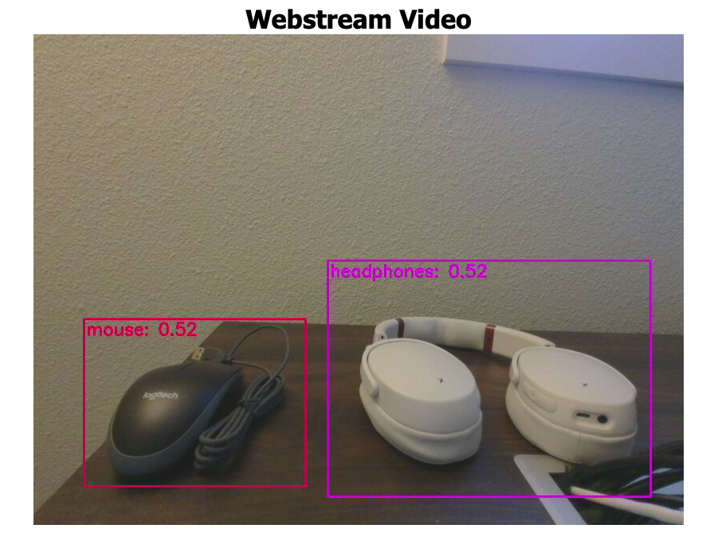

# Getting started with Advanced Development on the Percept DK via Jupyter Lab and Azure Machine Learning

## Prerequisites

1. Docker installed ([Docker Desktop on Windows](https://docs.docker.com/docker-for-windows/install/), [Docker Desktop on Mac](https://docs.docker.com/docker-for-mac/install/))
2. Git installed
3. Familiarity with Jupyter notebooks and Python 3
4. An Azure Percept DK device ([view and purchase here](https://www.microsoft.com/en-us/store/build/azure-percept/8v2qxmzbz9vc))

Tested with:
- Python 3.8
- Azure Vision module image:  `mcr.microsoft.com/azureedgedevices/azureeyemodule:2104-2`


## Setup for Percept DK

1. Follow the [Documentation](https://docs.microsoft.com/en-us/azure/azure-percept/quickstart-percept-dk-unboxing) to set up the Percept DK.

2.  Ensure the `azureeyemodule` IoT Edge Module has `ExposedPorts` and `PortBindings` with TCP rules as in the following example of `createOptions` section, found in the Edge deployment manifest template.

```
"azureeyemodule": {
    "settings": {
        "image": "mcr.microsoft.com/azureedgedevices/azureeyemodule:<latest tag>",
        "createOptions": {
            "HostConfig": {

                ...

                "ExposedPorts": {
                    "8554/udp": {},
                    "8554/tcp": {}
                },

                ...

                "PortBindings": {
                    "8554/udp": [
                        {
                        "HostPort": "8554"
                        }
                    ],
                    "8554/tcp": [
                        {
                        "HostPort": "8554"
                        }
                    ]

                    ...

                }
            }
        }
    }
}
```

You may wish to use VSCode with Azure IoT Tools or the Azure CLI to redeploy the Edge modules with the deployment manifest.

3. In addition, to allow communication from the Percept over TCP, set up an additional TCP packet rule as follows.  SSH into your Percept DK to do so.  To SSH in, use the terminal on your system or [putty.exe for Windows](https://www.chiark.greenend.org.uk/~sgtatham/putty/latest.html).  Perform the following command once on the device.

```
sudo iptables -A INPUT -p tcp --dport 8554 -j ACCEPT
```

## Setup for notebooks

### Local machine setup

1. Get Python 3.6+ ([Anaconda](https://www.anaconda.com/products/individual) is recommended).

2. Create an environment for your work to keep it clean and nuclear from other Python setups on your machine.  Follow [this guide](https://docs.conda.io/projects/conda/en/4.6.1/user-guide/tasks/manage-environments.html) for Conda environments.  If you wish for a specific version of Python in the Conda environment, add `python=3.6`  to the end of the create command as in: `conda create --name myenv python=3.8`.  An alternative to Conda is to use Python 3's [built-in `venv`](https://docs.python.org/3.6/library/venv.html) for non-Conda installs of Python 3.6+.

3. Activate the environment just created according to the appropriate documentation from step 2.

4. Git clone this repository locally and go to the directory with the Jupyter Notebooks.

```
git clone https://github.com/microsoft/azure-percept-advanced-development.git
cd azure-percept-advanced-development/machine-learning-notebooks/transfer-learning-custom-azureml
```

5. Install all packages into the activated environment with the following command.

```
pip install -r requirements.txt
```

> Alternatively, install each package separately, finding a version available to you closest to the version indicated.  On Windows, a great resource for Python package binaries is this [Unofficial Windows Binaries for Python Extension Packages](https://www.lfd.uci.edu/~gohlke/pythonlibs/) by Christoph Gohlke.

6. Start JupyterLab as follows (make sure you've activated your environment and installed the necessary packages).

```
jupyter lab
```

7. Access the notebooks locally from Jupyter Lab at the address provided when starting Jupyter Lab.

## Instructions

Work through the following notebooks in order.

- 1.Collect_Image_Data_from_PerceptDK.ipynb
- 2.Upload_and_Label_with_AzureML.ipynb
- 3.Train_with_AzureML.ipynb
- 4.Convert_to_OpenVINO.ipynb
- 5.Deploy_to_PerceptDK.ipynb

## Results in Web Stream from Percept DK

This web stream was accessible on a local network at:  `https://<ip-address-of-your-device>:3000`.  Only 50 images per class of objects was used to train the model, so the results could be improved with more data.


