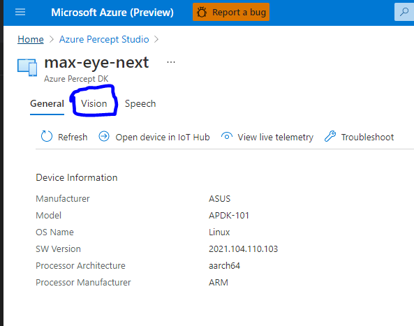

# ONVIF Profile S on the Azure Percept DK

**Please note!** The experiences in this repository should be considered to be in **preview/beta**.
Significant portions of these experiences are subject to change without warning. **No part of this code should be considered stable**.

## What is ONVIF?

[ONVIF](https://www.onvif.org/) is a group of standards for making sure that IP-connected security devices (typically cameras)
can interoperate. ONVIF publishes many standards. Several of them are called "Profiles". A profile is a standard that a device
or client can adhere to which ensures that it meets certain criteria for a specific scenario. For example, Profile C is for
ONVIF-compliant devices which are able to grant access to people by controlling a physical door.
See [here for more information](https://www.onvif.org/profiles/) regarding ONVIF profiles.

The Azure Percept DK is not seeking to become compliant with ONVIF, but we do provide an example implementation for you if
you would like to produce a 3rd party device based on this reference platform. This example implementation uses ONVIF Profile S,
which is used for IP cameras. This allows the Percept DK
to be compatible with ONVIF clients, so that the client can control the Percept DK and can view the RTSP stream eminating from the DK.

## Overview

We have developed a sample ONVIF Profile S device IoT Edge module for use on the Azure Percept DK.
This is a separate IoT Edge module, and must be deployed manually right now - it does not get
deployed automatically by OOBE during unboxing.

This module supports the following features:

* Device discovery
* User authentication
* Video streaming
* Streaming configuration such as resolution, FPS, transport type (UDP, TCP)
* Profile Management
* Change video encoder

## How to Configure your Device to use this Feature

There are two things you need to do to enable this feature, and these must currently be done manually.

First, the Azure Percept DK's firewall must be configured appropriately, and second, the ONVIF IoT Edge module must be deployed
with proper configuration.

### Firewall Configuration

SSH over to your device and open port 3702 for UDP and port 8081 for TCP with the following two commands:

```bash
sudo iptables -A INPUT -p udp --dport 3702 -j ACCEPT
sudo iptables -A INPUT -p tcp --dport 8081 -j ACCEPT
sudo docker restart azureeyemodule
```

This will need to be done every time you restart your device.

### Deploy the ONVIF IoT Edge Module

Besides the IoT Edge deployment manifest that OOBE has configured for your device, you will need additional configuration to enable the ONVIF features.
Additional configurations include container network mode, ONVIF module deployment configuration, and message routing.

Let's go through each step.

First, navigate to your IoT Hub Edge device page, either through the Azure Percept Studio or just through the main Azure Portal.
You should see a page like this:


You can see the modules that your device currently has on it. We will be adding a new one.

Click on "Set modules" in the top left:


You should now see this:


Click on "+Add" and select "IoT Edge Module":


Set the ONVIF module's image URI as your docker image.

The latest URI is mcr.microsoft.com/azureedgedevices/azureeyeonvifmodule:2103-1. Name it as azureeyeonvifmodule for example.


Set the container create option to

```json
{
    "NetworkingConfig": {
        "EndpointsConfig": {
            "host": {}
        }
    },

    "HostConfig": {
        "NetworkMode": "host"
    }
}
```

Push "Add" and "Revew+Create", and finally "Create".


You should already be running the azureeyemodule, but make sure that you are running the latest
version by going to the Azure Percept Studio:


Once in the Azure Percept Studio, click on "Devices" on the left side, then find your device and click on it:


Now click on "Vision":



If you are **not** running the latest version of the azureeyemodule, there will be a button like this:


**This button will not be present if you already have the latest version of the azureeyemodule.**

Click this button to ensure your azureeyemodule is the most up to date version.

Now head back to your device in IoT Hub, which you can get to by clicking on "Open device in IoT Hub" from this page:


Click on "Set Modules" in the top left again, then click "azureeyemodule":


Make sure the create option of azureeyemodule is as follows (it should be, but just double check).

```json
{
    "ExposedPorts": {
        "8554/tcp": {}
    },

    "HostConfig": {
        "Binds": [
            "/dev/bus/usb:/dev/bus/usb"
        ],

        "DeviceCgroupRules": [
            "c 189:* rmw"
            ],

        "PortBindings": {
            "8554/tcp": [
                {
                    "HostPort": "8554"
                }
            ]
        }
    }
}
```

Close out of that by clicking "update" and then click "Routes" and the top.


Add a route called "AzureONVIFToAzureEyeModule as
`FROM /messages/modules/azureeyeonvifmodule/outputs/output1 INTO BrokeredEndPoint("modules/azureeyemodule/inputs/onvif-control-msg-input")`:


Click on "Review and Create", then "Create" to create the new deployment, which will update your device right away.

You can also refer to [this sample deployment.json](./deployment.json).

## Results

Once the ONVIF module is deployed to the dev kit, you can launch an ONVIF client application such as
[ONVIF Device Manager](https://sourceforge.net/projects/onvifdm/) on your PC.


With an ONVIF client application, you can connect to the dev kit now and try the following features.

* Scan and discover the dev kit device (default name Azure Eye, you can change it in the source codes)
* View the stream with inference results (default user/password is root/root, please change it in the source codes for your further development)
* View the stream with transport type TCP and UDP.
* Save your profile and load it
* Change resolution, fps, etc.

Some attributes are rejected by design as it is not applicable to this dev kit. For example, HTTP/HTTPS, port changing, system management.
