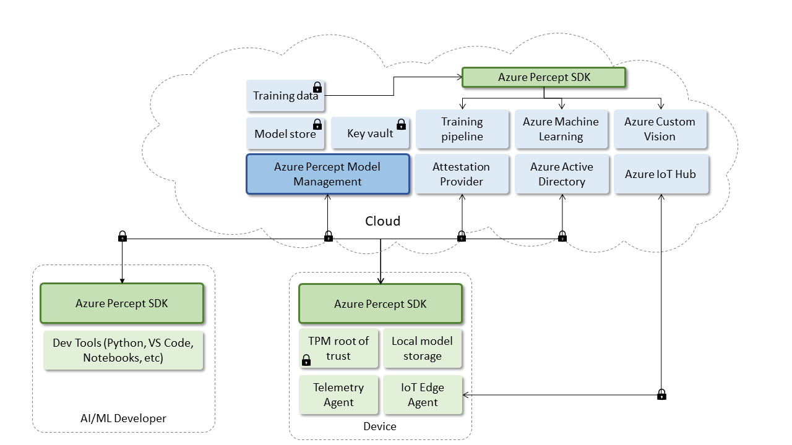

# Protecting your AI model and sensor data

- **Please note!** Azure Percept currently supports AI model protection as a private preview feature.  
- Portions of this code base are subject to change without notice.

Please consider taking our [Product survey](https://go.microsoft.com/fwlink/?linkid=2156573) to help us improve Azure Percept Model and Data Protection features based on your IoT Edge background and goals.

Azure Percept provides AI model protection [at rest](protection-at-rest.md) and [in transit](protection-in-transit.md). It's designed to work with existing AI systems and workflows such as [Azure Machine Learning](https://azure.microsoft.com/en-us/services/machine-learning/), [Azure Databricks](https://azure.microsoft.com/en-us/services/databricks/), and [Azure Cognitive Services](https://azure.microsoft.com/en-us/services/cognitive-services/). The long-term goal of Azure Percept is to provide a unified experience across underlying systems.

Azure Percept Studio can be configured with the Azure Percept Model Management (Azure Percept MM) and Azure Percept sample code (Azure Percept SDK), as highlighted in the following diagram. The [solution](server-topology.md) provides key and model management capabilities. 

 

To get started with provisioning a secured locker, see this [quickstart](provision-a-secured-locker.md).
