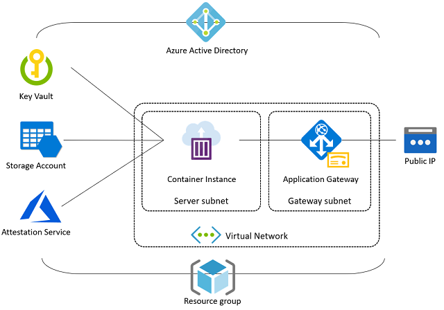

# Topology

- **Please note!** Azure Percept currently supports AI model protection as a private preview feature.  
- Portions of this code base are subject to change without notice.

Please consider taking our [Product survey](https://go.microsoft.com/fwlink/?linkid=2156573) to help us improve Azure Percept Model and Data Protection features based on your IoT Edge background and goals.

The Azure Percept MM service  runs as a single, stateless Docker container. This allows the service to be deployed and scaled on any hosting platforms where Docker containers are supported, including (but not limited to): [Azure Container Instances](https://azure.microsoft.com/en-us/services/container-instances/), [Azure Functions](https://azure.microsoft.com/en-us/services/functions/), [Azure Kubernetes Services](https://azure.microsoft.com/en-us/services/kubernetes-service), and other [Kubernetes](https://kubernetes.io/) clusters.

Azure Percept MM service relies on a few Azure services to deliver required capabilities such as key management, file management, authentication, attestation, and more. The following diagram illustrates how Azure Percept MM is deployed as an ACI instance, interacts with other Azure services.

* **Application Gateway**
  
  Azure Percept MM uses Application Gateway as the front door of the system. The gateway manages service certificate and does TLS termination (though end-to-end TLS is also possible).
  
* **Azure Active Directory**
  
  Azure Percept MM uses [Azure AD service principals](https://docs.microsoft.com/en-us/azure/active-directory/develop/app-objects-and-service-principals) for authentication and uses Azure AD to reinforce role-based access control (RBAC). Azure Percept MM also uses [managed identities](https://docs.microsoft.com/en-us/azure/active-directory/managed-identities-azure-resources/overview) where appropriate to establish cross-service security contexts.

* **Container Instance**

    Because the Azure Percept MM service is a lightweight, stateless web service, ACI (Azure Container Instances) is a nice choice to host Azure Percept MM instances with minimum cost. However, you can certainly choose to host the Azure Percept MM container in other environments (such as your existing Kubernetes clusters). By default, the Azure Percept MM service listens to port 5000 over HTTP protocol (only on the server subnet with the Application Gateway).

* **Key Vault**
  
    Azure Percept MM uses Azure Key Vault to manage encryption/decryption keys. Azure Percept MM generates a new key for each model version so that the key only works for a specific version of a specific AI model. Azure Percept MM also uses Azure Key Vault to manage the service certificate that is associated with the Application Gateway instance.

* **Public IP**
  
    Azure Percept MM associates a public IP to the Application Gateway instance and generates a DNS label, which you can use as the subject of your service certificate.

* **Storage Account**

    Azure Percept MM stores encrypted AI models and training data in Azure Storage containers. Compliance with any data retention policies or data governance requirements are the responsibility of tenant deploying Azure Percept MM services.

* **Virtual Network**

    The Azure Percept MM instance is deployed on a dedicated subnet of a virtual network, to which the Application Gateway is deployed (in its own subnet). The network security group (NSG) blocks all network traffic other than the inbounding 443 port for HTTPS connections.
