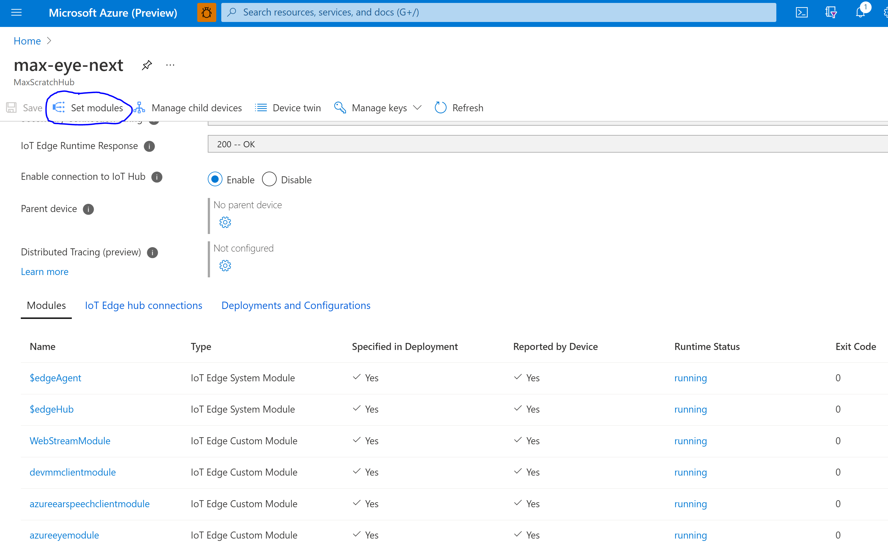
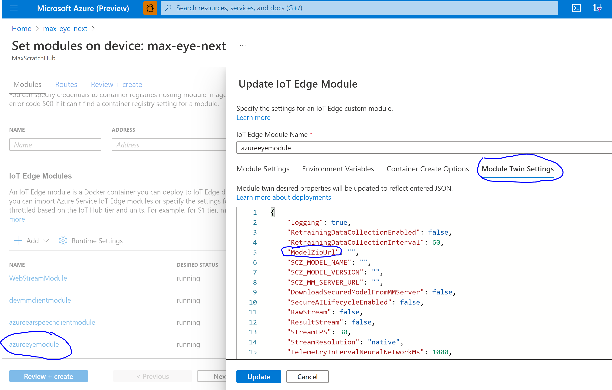

# Banana U-Net Tutorial

This tutorial will walk you through the typical workflow that you will be using to bring your own model or model pipeline to the
Azure Percept DK. This is the first of several tutorials. While we have tried to make this whole process as simple as we can,
the fact is that it is, by its very nature, complicated.

This tutorial uses a model that we have already ported to the device. The more advanced tutorials will walk you through every
step.

First, it is important to understand the whole architecture of the system and where the process of bringing your own model
fits in.

## Context

Broadly, here is how the Azure Percept DK works:

1. The Azure Percept DK takes camera images and feeds them into a Myriad X VPU, which is running a neural network.
1. That neural network will do inference on the RGB frames fed into it. This neural network could be anything,
   but let's say it is the default model of SSD (trained on COCO) - so it outputs bounding boxes. Again,
   it doesn't have to output bounding boxes; there are several built-in models you can use that do other things,
   but for the sake of this explanation, let's say it is outputting bounding boxes.
1. The VPU sends the inferences and raw frames back to the ARM chip for further processing.
1. The ARM chip is running a C++ application inside a Docker container. The container is called the azureeyemodule.
1. The application could do whatever you want, as it is open-sourced. In fact, it's [right here](../../azureeyemodule/README.md).
   But by default, it takes the inferences from the network and does two things: a) it packages them up into JSON messages
   to send out over Azure IoT, and b) it draws bounding boxes on the raw camera images and feeds those out via an RTSP server.
1. The azureeyemodule is running as part of Azure IoT Edge Runtime, which has been provisioned on the device's custom Linux
   build. You have already entered your credentials and whatnot via the Out Of Box Experience (OOBE). The messages that we
   send out of the azureeyemodule are fed up to the cloud via the Azure IoT Edge Runtime (which is just a collection
   of Docker containers, some configuration files, and some systemd daemons).

Note that there are a few points during this process that can be customized. Specifically, you can customize the application
that runs inside the azureeyemodule. This application is responsible for starting the Myriad X VPU, loading the latest firmware
onto it, then loading the neural network onto it. The whole application is completely customizable, as it is open-sourced,
but generally, you will want to make minor modifications to it simply regarding:

* What neural network you want to run.
* What the application does with the results from the neural network.

Now that you understand the context a bit better, we can move on with the rest of the tutorial. This tutorial will show you
how to train up a neural network and then how to port it to the device, but it will use a network that we have already
ported. Other tutorials show you how to write your own custom version of the azureeyemodule application from the ground-up.

For now, just follow along.

## Bananas!

This tutorial will walk you through the [banana U-Net semantic segmentation notebook](../../machine-learning-notebooks/train-from-scratch/README.md),
which will train a semantic segmentation model from scratch using a small dataset of bananas, and then convert the resulting ONNX model to OpenVINO IR,
then to OpenVINO Myriad X .blob format, and finally deploy the model to the device.

A few things to note before we get started:

* The license on this notebook is currently GPLv3. This differs from the rest of this repository!
* The point of this notebook is to train a PyTorch model from scratch that is suitable for deployment to the device.
  It also converts the model to the right format, and then deploys it to the device. This will not work for a custom model of your
  own making, because you will need to modify the azureeyemodule's inferencing application first.
  Once again, see the other tutorials after you are done with this one for instructions on how to bring a completely custom model.
* Once we are done with the notebook, we'll walk through the process you would have used to create this custom banana segmenter
  network on the device (even though we've already done it for you). This will show you all the tools you will likely be using
  to bring your own model and will introduce you to the whole workflow, while using something that should be pretty much guaranteed to already work.
  That way, you'll have something that already works to experiment with at the end of this tutorial.

## Setting up the Environment

In general, you can use whatever deep learning framework you want and whatever workflow for training and testing neural networks. Once you are done
with these tutorials, you should feel free to use whatever you want. But for now (since this is a Microsoft product), we will be using Azure Machine Learning.

First of all, if you haven't already done so, please complete the
[Get Started with Azure Machine Learning in Jupyter Notebooks Tutorial](https://docs.microsoft.com/en-us/azure/machine-learning/tutorial-1st-experiment-sdk-setup).
This will walk you through creating a workspace and some general usage of that workspace.

1. Once you have an Azure Machine Learning (AML) workspace, create a new folder in your workspace called "bananas-tutorial" (or whatever you want).
1. If you have not already cloned this repository, clone it to your local PC.
1. Now upload this repository's machine-learning-notebooks/train-from-scratch folder to your workspace. Don't upload the whole repository, as it is quite
   large, and you only need that one folder.
1. Once it completes the upload, you can click on the SemanticSegmentationUNet.ipynb notebook.
1. Feel free to delete or comment out the first cell (where it clones this repo into the workspace - we've already done this, and this command will clone
   the whole repository).

## Running the notebook

Most of the rest of the notebook should be self-explanatory. You can run all the cells until it asks you to perform the module twin update.
You can use the ">>" button to run all the cells up to that point - at that point it will crash, but no big deal. This will take a few hours.

Briefly, this notebook is doing the following:

* Setting up all the folders and importing everything
* Making sure the dataset looks good
* Provisioning a GPU compute node using your subscription
* Submitting a U-Net training script to the compute node for training
* Checking that the model's outputs look good
* Converting the model to ONNX (and double checking that it still looks good)
* Converting from ONNX to OpenVINO IR
* Converting from OpenVINO IR to OpenVINO Myriad X .blob format
* Uploading the blob with a config file to an Azure blob storage

At this point, assuming you have completed the notebook up to the point where it wants to deploy the model,
you should have a neural network that can segment bananas out of an indoor environment.

Again, please note that if you were creating your own model, you could do it however you want - the only thing that matters for this
is that you end up with the following:

* A neural network in either OpenVINO IR format or OpenVINO .blob format (in this case, we will use .blob format - but you can
  do the conversion from IR to .blob on the device)
* A config.json file that has "DomainType" and "ModelFileName".

These files must be packaged up into a .zip file and stored somewhere that your device has access to. Again, this could be anywhere,
the Azure Percept DK's azureeyemodule application just executes a 'wget' command to grab it from whatever URL we supply in the module
twin (which I will go over in a moment). Storing your model in a more secure location is obviously what you will typically do,
and for that (once you are done with these tutorials), please see the [Secured Locker Documentation](../../secured_locker/README.md).

One last thing before we deploy our model: if your model expected a labels file as well, you could save a "labels.txt" file
that has one label per line (with the line index corresponding to the index of the class).

## Deploying the Model

Now that we have the artifacts zipped up and in an Azure blob storage, we can download them to the device.

But before we do that, let's take a look at exactly what we are about to do and how it works.

All Azure IoT Edge modules can be configured via their *module twin*.

Go to the Azure Percept Studio, then click "Devices" -> select your device -> Open device in IoT Hub. This should show you
your device in IoT Hub. Azure Percept DK devices are simply Azure IoT devices with some extra goodies integrated.

One thing to note in this view is all the modules that are running on the device. You don't need to know about most of these
modules for this tutorial, but in case you are wondering (and please excuse if this list is outdated by the time you read this):

* **edgeAgent**: This is an IoT System Module. It is present in all Edge IoT deployments,
  and you can read more about it [here](https://docs.microsoft.com/en-us/azure/iot-edge/iot-edge-runtime?view=iotedge-2018-06#iot-edge-agent).
* **edgeHub**: This is an IoT System Module. It is present in all Edge IoT deployments,
  and you can read more about it [here](https://docs.microsoft.com/en-us/azure/iot-edge/iot-edge-runtime?view=iotedge-2018-06#iot-edge-hub).
* **WebStreamModule**: This module accepts the RTSP streams from the azureeyemodule and serves them up over HTTP.
* **azureearspeechclientmodule**: The speech module.
* **azureeyemodule**: The module that we will be mostly dealing with. Source [located here](../../azureeyemodule/README.md).
* **HostIpModule**: Retrieves your device's IP address so that it can tell the Percept Studio (which can then use it for the button
  that takes you to the local RTSP stream over HTTP).

Now click on "set modules" at the top left of this screen:



This view will allow you to manage where your Azure Percept DK device can pull Docker images from. Remember that each
module is just a Docker container. If you'd like, you can add your own custom modules - and this is a reasonable thing
to do in many cases. For example, you might modify the azureeyemodule to handle your own custom neural network,
but have another module which interacts with a sensor or actuator based on the messages it receives from the azureeyemodule's neural
network.

Click on azureeyemodule, then "Module Twin Settings". These settings control various aspects of the azureeyemodule's behavior.
See [here](../../azureeyemodule/README.md) for an explanation of all the values that you can enter here, but for the purposes
of this tutorial, we are really only interested in "ModelZipUrl", which needs a string URL.



Whenever something changes in the modue twin values, the edgeAgent module will notice and alert the corresponding module,
invoking a callback if there is one. If that callback parses the JSON in the module twin and expects the change you made,
it can do something as a result.

For example, if we were to change the "ModelZipUrl" string to "https://aedsamples.blob.core.windows.net/vision/aeddevkitnew/openpose.zip"
(as you can see in the top-level README for this repository), the edgeAgent module on your device will pick up the change
and send it over to the azureeyemodule. The azureeyemodule will then run some code in the [iot_update.cpp](../../azureeyemodule/app/iot/iot_update.cpp) module,
which parses the module twin JSON. It would detect the change made to the "ModelZipUrl" field, and then cause the current AI model
to exit its inference loop, set a flag to show that there is a new model that needs to be downloaded, the model would then get downloaded,
and the new AI model will run.

As long as you adhere to the right format for your .zip archive, your model will be downloaded and unpacked appropriately.

Specifically, the .zip archive must contain the following things:

1. A Myriad X .blob model file *or* an OpenVINO .xml and OpenVINO .bin model file.
1. An optional labels.txt file, which is only used by models that require label names. This file maps line number to class name.
1. A config.json file, which must use this schema:
```JSON
{
    "DomainType": "name-of-the-model-parser",
    "LabelFileName": "path-within-this-folder-to-labels.txt",
    "ModelFileName": "path-within-this-folder-to-model.blob-or-model.xml"
}
```

Note that "LabelFileName" is optional.

For example, the default SSD model's config.json file looks like this:

```JSON
{
    "DomainType": "ssd100",
    "LabelFileName": "labels.txt",
    "ModelFileName": "ssdlite-mobilenet-v2-fp32.blob"
}
```

But what values are allowed for "DomainType" you ask? Take a look at [parser.cpp](../../azureeyemodule/app/model/parser.cpp). You can
see that there is an enum of "Parser"s. Each parser represents a custom C++ class that subclasses off of [AzureEyeModel](../../azureeyemodule/app/model/azureeyemodel.hpp).
And each parser variant has its own string equivalent, as governed by the to- and from- string functions.

For our banana U-Net model, you can see that we already have one written for you, called "unet". This string maps to `Parser::UNET`.
If you hop over to [main.cpp](../../azureeyemodule/app/main.cpp), and look through it for "UNET", you will find a big switch
statement that determines what AI model class to instantiate based on this enum. In our case, it is invoking the `BinaryUnetModel` constructor.

If you were writing your own model from scratch (which you will do in the other tutorials), you would add a value to this enum (and the
string equivalent), and you would add your constructor to that switch statement. That's all the glue that you need to do in order to
get your custom model into the app's logic. All the IoT updates, messages, RTSP streams, etc. are all handled for you already.

But for now, let's get back to the notebook.

If you follow the notebook's directions to add your device's Hub's connection string and your device's device ID, then run the
rest of the cells, it will modify your device's azureeyemodule module twin JSON for you, to incorporate the "ModelZipUrl" that
points to the zipped up archive that we ealier pushed to Azure blob storage.

Once you have done that, you have completed the notebook, and can exit from it if you want.

## Viewing the Results

First, if your device is off, you will need to turn it on now. This can take a few minutes. If you are impatient, wait a bit, then
SSH over to your device and run `watch docker ps` to watch the Azure IoT Edge modules come up one by one. Once they are all up and running,
you should be able to watch the logs in azureeyemodule for the model redeployment. A handy command for watching the docker logs
is `docker logs -f azureeyemodule`. However, if your log file is particularly long, this can be rather terrible, as it has to spool
out all the old logs before it can get to the current stuff. Another option is `watch -n 0.1 docker logs --tail 100 azureeyemodule`,
which will just show you the latest 100 lines from that log file and update it every 10th of a second.

While we are on the subject of logs. If we haven't gotten around to configuring the Docker logs correctly by the time you
read this, you will likely want to [configure them manually](https://docs.docker.com/config/containers/logging/configure/)
yourself to have way less space taken up by ancient logs.

The U-Net we just trained is pretty sizeable for this VPU, so it will take about a minute or two download the model,
unzip it, and then to get the network loaded onto the device.
Once that's done, you will see the logs change to something like `<Time Stamp> [{"occupied": "0.0000"}]`, which means the network is running
and outputting messages. If you were to check your IoT Hub message ingestion right now, you would see these messages coming through.

If you happen to have some bananas on hand, you can launch VLC media player and click on Media->Open Network Stream->"rtsp://your-device-ip-address/result"
(assuming that you have result RTSP stream turned on in your module twin settings). The world should be red, except for banans, which will look green
(though there is a bit of latency on this network).

## How does it Work?

Now that the model is looking for bananas and outputting RTSP streams and messages, let's take a closer look at how exactly it works under the hood.

Take a look at [BinaryUNet](../../azureeyemodule/app/model/binaryunet.hpp). You can see that this is a C++ class that subclasses off of
[AzureEyeModel](../../azureeyemodule/app/model/azureeyemodel.hpp). All custom neural network modules should subclass of `AzureEyeModel`,
which is an abstract base class. Therefore you need to implement its abstract method:

```C++
    /**
     * This method will run the model by pulling data through its OpenCV GAPI graph.
     * This method is meant to handle the output of the model at each frame,
     * meaning sending messages or RTSP feed, for example.
     *
     * This method will return only once we run out of frames (if we have a finite source) or
     * if we call set_update_flag();
     */
    virtual void run(cv::GStreamingCompiled*) = 0;
```

This is the *only* method you need to implement (other than your constructor) in your derived class.
Of course, you are free to make your class as complicated as you want! We have several example model modules that you can use
to work off of while implementing this method. But to make it easier on you, let's walk through BinaryUNet's implementation together.

In [BinaryUNet's .cpp file](../../azureeyemodule/app/model/binaryunet.cpp), you can see that we have implemented this method like
this (and please excuse if this is somewhat out of date compared to the actual file):

```C++
void BinaryUnetModel::run(cv::GStreamingCompiled* pipeline)
{
    while (true)
    {
        // We must wait for the Myriad X VPU to come up.
        this->wait_for_device();

        // Now let's log our model's parameters.
        this->log_parameters();

        // Build the camera pipeline with G-API and start it.
        *pipeline = this->compile_cv_graph();
        util::log_info("starting segmentation pipeline...");
        pipeline->start();

        // Pull data through the pipeline
        bool ran_out_naturally = this->pull_data(*pipeline);
        if (!ran_out_naturally)
        {
            break;
        }
    }
}
```

This is pretty much identical in all the example classes, which means it is almost entirely boilerplate.

We run in a loop until `this->pull_data(*pipeline)` returns `false`. We'll get to that in a moment.
Before that, you can see that we call `this->wait_for_device()`, which is a superclass method
that blocks until the VPU is ready, then we log all of our parameters.

Logging parameters looks like this:

```C++
void BinaryUnetModel::log_parameters() const
{
    std::string msg = "blobs: ";
    for (const auto &blob : this->modelfiles)
    {
        msg += blob + ", ";
    }
    msg += "firmware: " + this->mvcmd;
    util::log_info(msg);
}
```

You can see, all it does is log what we are doing. Feel free to copy this or do your own thing, or even not
have a `log_parameters()` method. It's up to you.

Then we compile the G-API graph, start it, and pull data through it. This is where things get more interesting.

Take a look at BinaryUNet's `compile_cv_graph()` method:

```C++
cv::GStreamingCompiled BinaryUnetModel::compile_cv_graph() const
{
    // The input node of the G-API pipeline. This will be filled in, one frame at time.
    cv::GMat in;

    // We have a custom preprocessing node for the Myriad X-attached camera.
    cv::GMat preproc = cv::gapi::mx::preproc(in, this->resolution);

    // This path is the H.264 path. It gets our frames one at a time from
    // the camera and encodes them into H.264.
    cv::GArray<uint8_t> h264;
    cv::GOpaque<int64_t> h264_seqno;
    cv::GOpaque<int64_t> h264_ts;
    std::tie(h264, h264_seqno, h264_ts) = cv::gapi::streaming::encH264ts(preproc);

    // We branch off from the preproc node into H.264 (above), raw BGR output (here),
    // and neural network inferences (below).
    cv::GMat img = cv::gapi::copy(cv::gapi::streaming::desync(preproc));
    auto img_ts = cv::gapi::streaming::timestamp(img);

    // This node branches off from the preproc node for neural network inferencing.
    cv::GMat bgr = cv::gapi::streaming::desync(preproc);
    auto nn_ts = cv::gapi::streaming::timestamp(bgr);

    // Here's where we actually run our neural network. It runs on the VPU.
    cv::GMat segmentation = cv::gapi::infer<UNetNetwork>(bgr);

    // Here's where we post-process our network's outputs into a segmentation mask.
    cv::GMat mask = cv::gapi::streaming::PostProcBinaryUnet::on(segmentation);

    // Specify the boundaries of the G-API graph (the inputs and outputs).
    auto graph = cv::GComputation(cv::GIn(in),
                                  cv::GOut(h264, h264_seqno, h264_ts,      // H.264 path
                                           img, img_ts,                    // Raw BGR frames path
                                           mask, nn_ts));                  // Neural network inference path

    // Pass the actual neural network blob file into the graph. We assume we have a modelfiles of length 1.
    CV_Assert(this->modelfiles.size() == 1);
    auto networks = cv::gapi::networks(cv::gapi::mx::Params<UNetNetwork>{this->modelfiles.at(0)});

    // Here we wrap up all the kernels (the implementations of the G-API ops) that we need for our graph.
    auto kernels = cv::gapi::combine(cv::gapi::mx::kernels(), cv::gapi::kernels<cv::gapi::streaming::GOCVPostProcBinaryUnet>());

    // Compile the graph in streamnig mode; set all the parameters; feed the firmware file into the VPU.
    auto pipeline = graph.compileStreaming(cv::gapi::mx::Camera::params(), cv::compile_args(networks, kernels, cv::gapi::mx::mvcmdFile{ this->mvcmd }));

    // Specify the Percept DK's camera as the input to the pipeline.
    pipeline.setSource(cv::gapi::wip::make_src<cv::gapi::mx::Camera>());

    util::log_info("Succesfully compiled segmentation pipeline");
    return pipeline;
}
```

Don't be intimidated by this! G-API is not too complicated, but we will not get into it too much here. The next tutorial delves very deep
into it. But for this tutorial, let's just go over the basics.

OpenCV G-API is a just-in-time compiled, graph-based model of computation. It allows you to (much like in Tensorflow 1.x), create a computational
graph, compile that graph, then run the graph by supplying it with inputs. In this method, we are simply creating the graph.

To create the graph, we call `cv::GComputation()`, which is a constructor for the graph. This construtor takes the inputs and the outputs
to the graph as arguments. As you can see, this means that G-API is keeping track of how all the nodes in the graph are connected.

When the graph has been created, we call `compileStreaming()` on it, which takes the parameters of our camera, the neural network blob file(s),
kernels (which we will go over in a moment), and the VPU's firmware.

Most of that is boilerplate and you don't need to worry about it, but I do want to point out the "kernels". G-API separates interface from implementation.
This means that the graph needs to know the types of things that go into a graph operation and the types of things that come out of it,
but until you call `compileStreaming()`, it doesn't need to know what the operations actually do. The actual implementations of the operations
are called "kernels". All of this will be gone over in detail in the other tutorials.

When the graph gets compiled, it sends the graph to the G-API's Just-In-Time (JIT) compiler, which partitions the graph onto the various devices
(in our case, onto the VPU and the ARM chip).

Once we have compiled the graph with the appropriate kernels, we call `setSource()` on it to give it the camera as the input for the graph.

The next method we call in the `run()` method is `pull_data()`. Here is the source code for BinaryUNet's implementation of this:

```C++
bool BinaryUnetModel::pull_data(cv::GStreamingCompiled &pipeline)
{
    // The raw BGR frames from the camera will fill this node.
    cv::optional<cv::Mat> out_bgr;
    cv::optional<int64_t> out_bgr_ts;

    // The H.264 information will fill these nodes.
    cv::optional<std::vector<uint8_t>> out_h264;
    cv::optional<int64_t> out_h264_seqno;
    cv::optional<int64_t> out_h264_ts;

    // Our neural network's frames will fill out_mask, and timestamp will fill nn_ts.
    cv::optional<cv::Mat> out_mask;
    cv::optional<int64_t> out_nn_ts;

    // Because each node is asynchronusly filled, we cache them whenever we get them.
    cv::Mat last_bgr;
    cv::Mat last_mask;

    // If the user wants to record a video, we open the video file.
    std::ofstream ofs;
    if (!this->videofile.empty())
    {
        ofs.open(this->videofile, std::ofstream::out | std::ofstream::binary | std::ofstream::trunc);
    }

    util::log_info("Pull_data: prep to pull");

    // Pull the data from the pipeline while it is running.
    // Every time we call pull(), G-API gives us whatever nodes it has ready.
    // So we have to make sure a node has useful contents before using it.
    while (pipeline.pull(cv::gout(out_h264, out_h264_seqno, out_h264_ts, out_bgr, out_bgr_ts, out_mask, out_nn_ts)))
    {
        this->handle_h264_output(out_h264, out_h264_ts, out_h264_seqno, ofs);
        this->handle_inference_output(out_mask, out_nn_ts, last_mask);
        this->handle_bgr_output(out_bgr, out_bgr_ts, last_bgr, last_mask);

        if (this->restarting)
        {
            // We've been interrupted
            this->cleanup(pipeline, last_bgr);
            return false;
        }
    }

    // Ran out of frames
    return true;
}
```

Again, don't be intimidated. We will go over all of this again in detail in the next tutorials. For now,
let's just talk about the basic stuff.

First, we declare an `optional` that matches each of the compiled graph's output nodes. When we pull data through the
G-API's compiled graph, each output node will be filled as often as possible, in an asynchronous manner. Because of this,
some output nodes may have values at times that other nodes do not. Hence, each of these nodes may be *optionally* filled with
a value.

It is also possible to run in synchronous mode. To do this, you would need to remove all the `desync` calls from the graph
construction and remove the `optional`s. In that mode, the G-API graph does not give you any values until every output node
has a value ready.

We opt for asynchronous mode because we want to pull the raw RGB frames from the camera as fast as we can (to send them over
the RTSP stream), but many neural networks have significant latency, and we would prefer to update the raw RTSP stream
at about 30 FPS, regardless of the rate at which the neural network is running.

Feel free to explore the three `handle_x` methods. These are the main difference for each custom model - each one will probably
use the same `handle_h264_output()`, but the other two are different for pretty much every model, as each model
has a different purpose; some draw bounding boxes on the RGB frames, some draw human poses, etc.

There is one gotcha though: you can never expect two asynchronous node outputs (two `optionals`) to come at the same time
unless they are part of the same branch in the graph. For example, the out_h264 items are all guaranteed to arrive at the
same time (if you look at the G-API graph declaration up above, you should see why), but the none of the other nodes in this
graph are guaranteed to arrive at the same time as these ones, and in principle they never will. Therefore a common pattern is to cache
the latest output from each node in a `latest_` variable, and reuse that result until you have a more recent one.

## Next Steps

You should now understand how the azureeyemodule fits into the Azure Percept DK, what parts must be updated to bring
your own model, and what parts you can update to add your own business logic. The next tutorials will go into
detail about what tools we have available for helping you to bring your own model pipeline and they will walk through
actually writing a custom C++ module, building it into the azureeyemodule's inferencing application, and then
deploying your custom payload.

For now, try playing around with what you've learned so far. Maybe change out the network's dataset and retrain it on
some other semantic segmentation dataset, like VOC (though you'll have to filter it down to only two classes - background
and whatever class you choose).

If you are feeling brave enough to take on bringing your own model pipeline without reading more tutorials,
take a look at the fine details of the azureeyemodule application in [its README file](../../azureeyemodule/README.md).

Otherwise, head on over to [another tutorial](../README.md).