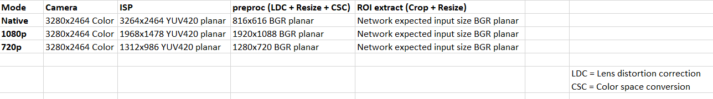
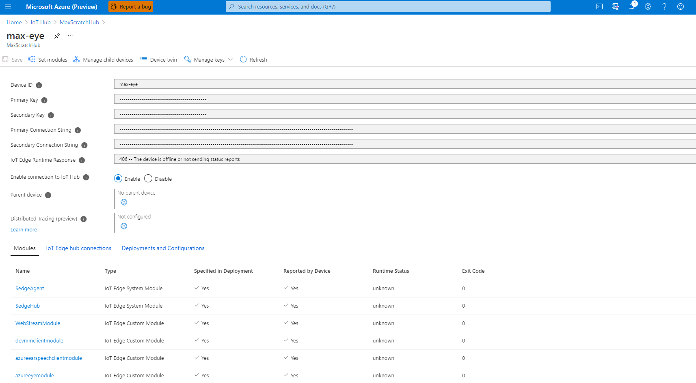
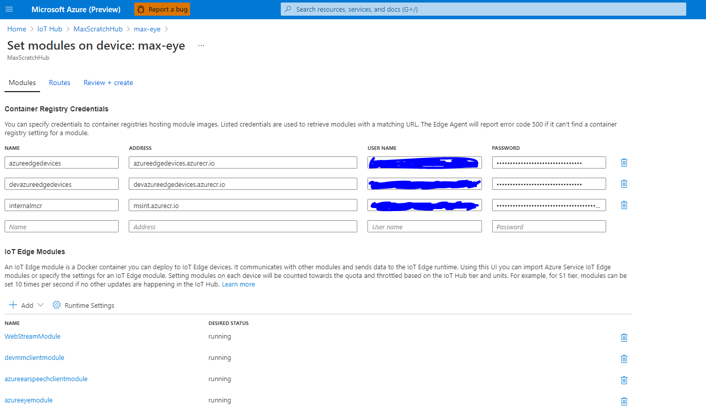
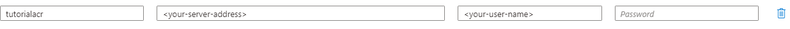

# PyTorch from Scratch Tutorial

**Please note!** The experiences in this repository should be considered to be in **preview/beta**.
Significant portions of these experiences are subject to change without warning. **No part of this code should be considered stable**.

## Table of Contents

1. [Introduction](#introduction)
1. [Input Format](#input-format)
1. [Network Size](#network-size)
1. [Training up a Brand New Model](#training-up-a-brand-new-model)
1. [Mock Eye Module](#mock-eye-module)
1. [AzureEyeModule](#azureeyemodule)
1. [Packaging It All Up](#packaging-it-all-up)


## Introduction

This tutorial will walk you through the following steps:

1. Training a brand new model in PyTorch
1. Writing a G-API graph in a C++ subclass in the azureeyemodule's application
1. Deploying the new model to the device

Before we get to it though, there are a few things we should go over.

## Input Format

The Azure Percept DK takes in images, one at a time, from the camera sensor. The camera sensor is wide-angled and high resolution,
but its output gets preprocessed a bit before we feed it into neural networks, according to the following table.



The table shows that we currently support three resolution modes: native, 1080p, and 720p. Either way, the image is ultimately resized
to whatever image size is expected by the network. So we don't really need to worry about the size of the input image.

## Network Size

We use an Intel Myriad X VPU for neural network acceleration on the Azure Percept DK. If your neural network is too large,
it won't fit in the VPU memory, and your network will run extremely slowly.

Unfortunately, we can't say how large a network is too large, since that's not how the Myriad X works. The VPU has
an approximately 1.3 GB region of memory that is used to store a bunch of different things, one of which is the neural network(s).
Personally, I have found that less than 50 MB for a .blob file is something to strive for, and 100 MB may take forever to load
onto the accelerator.

## Training up a Brand New Model

This folder contains a few things:

* .amlignore: This file tells Azure Machine Learning Studio what folders to ignore when creating an environment for experimentation.
* PyTorchModelFromScratch.ipynb: This file is a Python notebook that walks you through training up a new semantic segmentation network.
* requirements.txt: The requirements you need to install (or AML needs to install) to run train.py.
* train.py: The Python training script. It runs PyTorch to train a semantic segmentation neural network.

We will use Azure Machine Learning (AML) Studio with the PyTorchModelFromScratch.ipynb notebook to train the network. You do not have to use
AML for this! You can use whatever workflow you are accustomed to for training neural networks. Tensorflow, Caffe, PyTorch - train locally or
in the cloud, whatever. As long as you end up with a model file that can be converted to run on a Myriad X VPU, you are fine.

Let's assume you are using AML Studio though for the sake of this tutorial (since I can't write a tutorial for all possible combinations of
workflows).

To train the network, use the same Studio Workspace you created in the Banana tutorial, but make sure to make a new folder and upload
this directory's contents to it. You should end up with something like this (the Users/ and You/ folders aren't necessarily there):

```
Users/
    |
    |-- You/
        |
        |-- banana-notebook/
        |-- pytorch-from-scratch-tutorial/
            |
            |-- .amlignore
            |-- PyTorchModelFromScratch.ipynb  <-- Run this notebook in your workspace
            |-- requirements.txt
            |-- train.py
```

Once you have that, you can head over to the Azure ML Studio and run through the whole notebook. It should take a few hours.

Briefly, the notebook does the following:

1. Composes a dataset for semantic segmentation.
1. Trains a neural network for this task.
1. Converts the resulting .pth model to ONNX.
1. Converts the ONNX model to OpenVINO IR.
1. Converts the OpenVINO IR format model to Myriad X blob format.

The last step is to package up your model for deployment, but as you can see in the notebook
(if you are following along), it says that you can't complete that section until you've come back here
and completed the rest of the tutorial. So let's do that now.

At this point, you have a model for testing, in the following formats:

* PyTorch .pth
* ONNX
* OpenVINO IR
* OpenVINO Myriad X .blob

The device is capable of using either OpenVINO IR or .blob, but it is best to use .blob with it,
otherwise it has to convert the IR to .blob on device, which adds to deployment time and can be a pain
to debug if something goes wrong.

Future improvements will likely add better support for ONNX on the device.

But for testing locally, we will use OpenVINO IR.

## Mock Eye Module

At the root of this repository is a [mock-eye-module](../../mock-eye-module/README.md) folder, which is useful for porting models from
PC to the Azure Percept DK. You could instead port the model directly into the azureeyemodule application and deploy it onto the device,
but, being an embedded device, the Azure Percept DK is not a great tool for going through debugging cycles.

So let's port the model to the Mock Eye Module and make sure it works there before we port it all the way over to the device.

> **_NOTE:_** The Mock Eye Module runs on your CPU (or if you are running Linux, you can use a Neural Compute Stick 2 as well).
              Just because a neural network works on your 128 GB RAM, Intel i7, doesn't mean that it is going to work satisfactorily
              on the Myriad X VPU and ARM chip. Keep this in mind when porting!

If you look at the mock-eye-module directory, you can see it contains a C++ application that can be compiled and run using
Docker. Let's build it and run it before making any changes to it, just to make sure it works.

### Prerequisites

Whether you are on Linux/OSX or Windows, you should be able to run the OpenVINO workbench to procure an SSD model, which
we will use for testing the mock eye module.

```bash
cd ../../scripts
./run_workbench.sh # if you are on windows, you can use ./run_workbench.ps1 instead
```

Follow the link it displays to the console if it does not automatically open a new tab in a browser.

1. Once in the browser, accept the cookies and push "create" in the top left to create a new configuration.
1. Now click "import" in the middle of the page.
1. Under the "Open Model Zoo" tab, search for ssd_mobilenet_v2_coco and select it and then "import and download".
1. FP16 or FP32 are both acceptable (when doing this for the device, you will generally want FP16). Push "Convert".
1. Once it completes, you may click the download arrow on the far right.
1. Extract the tar.gz archive to get the two files: `ssd_mobilenet_v2_coco.bin` and `ssd_mobilenet_v2_coco.xml`. These
   two files comprise what is called the OpenVINO IR (or intermediate representation) format of this model.
   The XML file contains the topography of the model, and the .bin file contains the weight values.
1. Put these two files wherever is convenient.

Now go and find an mp4 file from somewhere. I haven't uploaded one to GitHub, but you can find all kinds of movie files
out there under whatever licenses. In fact, Intel has a GitHub that hosts some small video files for their demos,
so you could [check that out](https://github.com/intel-iot-devkit/sample-videos),
in particular, car-detection.mp4 and person-bicycle-car-detection.mp4 are both fine. Or use your own.

I'll use person-bicycle-car-detection.mp4 for this tutorial, but I'll try to make sure it works for car-detection.mp4 as well.

### Unix

If you are on Linux (I don't have Mac, so I can't test it, but it probably works too),

```bash
# Make sure you are in the mock-eye-module directory
cd ../../mock-eye-module
./scripts/compile_and_test.sh --video=<path to the video file> --weights=<path to the .bin> --xml=<path to the .xml>
```

### Windows

Unfortunately, there is some additional set up for Windows. See [the appropriate README](../../mock-eye-module/README.md)
for instructions. You will need to install VcXsrv and then launch it. Because you will be getting your XWindow GUIs
over an XWindow server, you will need to give the Docker container your IP address.

```powershell
cd ../../mock-eye-module
# You don't need the .bin file here because it figures it out from the .xml file, as long as they have
# the same name and are in the same folder.
# Why didn't I do this for the bash script too? I don't know.
./scripts/compile_and_test.ps1 -ipaddr <your IP address> -xml <path-to-the-xml> -video <path-to-the-video>
```

Whatever OS you are running, the result should be the same. The script should create a tmp folder, copy all the
source code into it, copy the .mp4 file into it, copy the model files into it, then launch a Docker container
that compiles and runs the application. You should see a GUI display the video, with bounding boxes overlayed on
it whenever the SSD network detects something above a certain confidence threshold.

We didn't bother feeding a labels file into this, so the labels are just numbers. It doesn't matter though,
since the point is just to make sure it works.

To stop it, hit CTRL-C and then run `docker ps` and `docker stop <whichever-container>`.

If you are curious, you could try the same thing using OpenVINO Model Zoo's `faster_rcnn_resnet50_coco` (parser argument "faster-rcnn"),
`yolo-v2-tiny-tf` (parser argument "yolo"), or OpenPose (parser argument "openpose"). The first two can be downloaded from the workbench, the OpenPose model
can be [downloaded from here](https://download.01.org/opencv/2021/openvinotoolkit/2021.1/open_model_zoo/models_bin/1/human-pose-estimation-0001/FP32/).
If you use any of these, you will need to give a --parser argument.

### Porting the Model to the Mock Eye Module

Now that we've got a sandbox to test our model in, let's work on porting the semantic segmentation model over to it.

First, download the .bin and .xml files from the "outputs" folder of the AML Workspace that you ran the notebook in.

Now let's go through what you will need to do to add support for this model to the mock-eye-module. Remember the point of adding
support for this model to the mock-eye-module is that doing so will put us about halfway towards our real goal of porting
this model to the Percept application instead. This sandbox application will allow us to run GDB and to feed a movie file
as an input to the application, while also being a much smaller application that is easier to reason about.

Here are the steps that are needed to add support to the mock-eye-module:

1. Add a new "parser" variant to the enum in mock-eye-module/modules/parser.[c/h]pp,
   and don't forget to update the `look_up_parser()` function there so the command line can accept your parser as an argument.
1. Add a folder under `modules` called `segmentation`, and then update the CMakeLists.txt file to include the new folder.
1. Put all of our runtime logic in the `modules/segmentation` folder, which will include compiling a G-API graph,
   passing the graph our custom kernels (which we will make in this tutorial), and then running the graph, collecting
   the graph's outputs, and interpreting them.
1. Implement whatever custom kernels we need for our G-API graph.

Once we have completed these steps, porting the resulting logic to the Percept DK should be pretty simple, meanwhile, we'll complete all
of these steps on our host PC, which should make development quite a bit more comfortable.

Let's go through these steps one at a time.

### Parser Enum

In order to integrate our new model (and its post-processing logic - i.e., "parser") into the mock app, we need to tell the command line
arguments and the main function that we have a new AI model that we can accept.

Let's start by updating the enum and look-up function in `mock-eye-module/modules/parser.hpp` and `mock-eye-module/modules/parser.cpp`:

First, here's the .hpp file:

```C++
// The contents of this enum may have changed by the time you read this,
// because maybe I forgot to update this documentation. But either way,
// find this enum and update it to include "UNET_SEM_SEG" or whatever you want to call it.
enum class Parser {
    FASTER_RCNN,
    OPENPOSE,
    SSD100,
    SSD200,
    // Here's the new item
    UNET_SEM_SEG,
    YOLO
};
```

Next, here's the .cpp file:

```C++
Parser look_up_parser(const std::string &parser_str)
{
    if (parser_str == "openpose")
    {
        return Parser::OPENPOSE;
    }
    else if (parser_str == "ssd100")
    {
        return Parser::SSD100;
    }
    else if (parser_str == "ssd200")
    {
        return Parser::SSD200;
    }
    else if (parser_str == "yolo")
    {
        return Parser::YOLO;
    }
    else if (parser_str == "faster-rcnn")
    {
        return Parser::FASTER_RCNN;
    }
    else if (parser_str == "unet-seg") ///////// This is the new one
    {                                  /////////
        return Parser::UNET_SEM_SEG;   /////////
    }                                  /////////
    else
    {
        std::cerr << "Given " << parser_str << " for --parser, but we do not support it." << std::endl;
        exit(-1);
    }
}
```

Now update main.cpp:

```C++
// Make sure to include this
#include "modules/segmentation/unet_semseg.hpp"

// .... other code

/** Arguments for this program (short-arg long-arg | default-value | help message) */
static const std::string keys =
"{ h help    |        | Print this message }"
"{ d device  | CPU    | Device to run inference on. Options: CPU, GPU, NCS2 }"
"{ p parser  | ssd100 | Parser kind required for input model. Possible values: ssd100, ssd200, yolo, openpose, faster-rcnn, unet-seg }" // Update the help message
"{ w weights |        | Weights file }"
"{ x xml     |        | Network XML file }"
"{ labels    |        | Path to the labels file }"
"{ show      | false  | Show output BGR image. Requires graphical environment }"
"{ video_in  |        | If given, we use this file as input instead of the camera }";

// .... clip some more code

// Here we are in main():
    std::vector<std::string> classes;
    switch (parser)
    {
        case parser::Parser::OPENPOSE:
            pose::compile_and_run(video_in, xml, weights, dev, show);
            break;
        case parser::Parser::SSD100:  // Fall-through
        case parser::Parser::SSD200:  // Fall-through
        case parser::Parser::YOLO:
            classes = load_label(labelfile);
            detection::compile_and_run(video_in, parser, xml, weights, dev, show, classes);
            break;
        case parser::Parser::FASTER_RCNN:
            classes = load_label(labelfile);
            detection::rcnn::compile_and_run(video_in, xml, weights, dev, show, classes);
            break;
        case parser::Parser::UNET_SEM_SEG:                                        // NEW CODE
            classes = load_label(labelfile);                                      // NEW CODE
            semseg::compile_and_run(video_in, xml, weights, dev, show, classes);  // NEW CODE
            break;                                                                // NEW CODE
        default:
            std::cerr << "Programmer error: Please implement the appropriate logic for this Parser." << std::endl;
            exit(__LINE__);
    }
```

So now we've updated all the logic we need to route the application's flow to the right place if the user executes
this application with the `--parser unet-seg` argument.

Of course, this won't compile yet, since we don't have a `semseg` at all, let alone a `compile_and_run` function in it.
So let's code up that function now.

### Modules/Segmentation

Create a folder where we will put all of our semantic segmentation code: `mkdir modules/segmentation`.

Now let's create the header file, which will be entirely boilerplate:

```C++
// Put this in a file called mock-eye-module/modules/segmentation/unet_semseg.hpp

/**
 * Copyright (c) Microsoft Corporation.
 * Licensed under the MIT license.
 */
#pragma once

// Standard library includes
#include <string>
#include <vector>

// Our includes
#include "../device.hpp"
#include "../parser.hpp"

namespace semseg {

/**
 * Compiles the GAPI graph for a semantic segmentation model (U-Net, specifically) and runs the application. This method never returns.
 *
 * @param video_fpath: If given, we run the model on the given movie. If empty, we use the webcam.
 * @param modelfpath: The path to the model's .xml file.
 * @param weightsfpath: The path to the model's .bin file.
 * @param device: What device we should run on.
 * @param show: If true, we display the results.
 * @param labels: The labels this model was built to detect.
 */
void compile_and_run(const std::string &video_fpath, const std::string &modelfpath, const std::string &weightsfpath, const device::Device &device, bool show, const std::vector<std::string> &labels);

} // namespace semseg
```

How did I know that that's the code I should put in the header? By looking at `modules/objectdetection/faster_rcnn.hpp`.

Each of the arguments to the single function that we need to implement is explained in the header file, but
to be more verbose:

* `video_fpath`: Must be a valid path to a video file. Note that on Windows, the webcam won't work - only video files are supported.
* `modelfpath`: The path to the model's .xml file. Remember that each model is in the OpenVINO IR format, and therefore is composed
  of a topology (.xml) file and a weights (.bin) file.
* `weightsfpath`: The path to the model's .bin file.
* `device`: We haven't talked about devices. If you are curious, you can check in the device module, but the gist of it is that since the Inference Engine
  OpenCV back end we use in this application supports GPUs, Myriad X VPUs, and CPUs, I figured we could just support all of them. Unfortunately for Windows
  users, only CPU is supported.
* `show`: We don't need to show the GUI, but it is cool (and helpful for debugging). You could certainly get a way with just using
  `std::cout` messages.
* `labels`: Our U-Net model is trained to do semantic segmentation on particular items. If we don't give this over to the function,
  we'll make sure that the function just displays numbers instead of labels, so it is technically optional. Nonetheless, we'll pass something in either way,
  and if the function can't find the given file (perhaps because it is just an empty string, and not a file path at all), then we'll ignore this arg
  and output numbers instead of letters.

Let's add the .cpp file now. We will start slow - we'll just create a G-API graph that takes in the input video frames
and outputs them unchanged. I've worked with the G-API a bunch by this point, and trust me when I say that you want
to start small. Don't dive in and create a gigantic computational graph - the OpenCV G-API library is still very young,
so there isn't a whole lot of documentation out there to help you if you run into an obscure error.

```C++
// Put this in a file called mock-eye-module/modules/segmentation/unet_semseg.cpp

// Copyright (c) Microsoft Corporation.
// Licensed under the MIT license.

// Standard library includes
#include <iomanip>
#include <random>
#include <string>
#include <vector>

// Third party includes
#include <opencv2/core/utility.hpp>
#include <opencv2/gapi/core.hpp>
#include <opencv2/gapi/infer.hpp>
#include <opencv2/gapi/infer/ie.hpp>
#include <opencv2/highgui.hpp>
#include <opencv2/gapi/streaming/cap.hpp>

// Our includes
#include "../../kernels/utils.hpp"
#include "../device.hpp"
#include "../parser.hpp"
#include "unet_semseg.hpp"

namespace semseg {

// This macro is used to tell G-API what types this network is going to take in and output.
// In our case, we are going to take in a single image (represented as a CV Mat, in G-API called a GMat)
// and output a tensor of shape {Batch size (which will be 1), N_CLASSES, 128 pixels high, 128 pixels wide},
// which we will again represent as a GMat.
//
// The tag at the end can be anything you want.
//
// In case you are wondering, it is <output(input)>
G_API_NET(SemanticSegmentationUNet, <cv::GMat(cv::GMat)>, "com.microsoft.u-net-semseg-network");

// First version:
//
// All it does is take in the video file, frame by frame, and pipe it through a do-nothing G-API graph,
// and then display the frames.
void compile_and_run(const std::string &video_fpath, const std::string &modelfpath, const std::string &weightsfpath, const device::Device &device, bool show, const std::vector<std::string> &labels)
{
    // Create the network itself. Here we are using the cv::gapi::ie namespace, which stands for Inference Engine.
    // On the device, we have a custom back end, namespaced as cv::gapi::mx instead.
    auto network = cv::gapi::ie::Params<SemanticSegmentationUNet>{ modelfpath, weightsfpath, device::device_to_string(device) };

    // Graph construction //////////////////////////////////////////////////////

    // Construct the input node. We will fill this in with OpenCV Mat objects as we get them from the video source.
    cv::GMat in;

    // This is the only thing we are doing so far: copying the input to the output.
    auto raw_input = cv::gapi::copy(in);
    auto graph_outs = cv::GOut(raw_input);


    // Graph compilation ///////////////////////////////////////////////////////

    // Set up the inputs and outpus of the graph.
    auto comp = cv::GComputation(cv::GIn(in), std::move(graph_outs));

    // Now compile the graph into a pipeline object that we will use as
    // an abstract black box that takes in images and outputs images.
    auto compiled_args = cv::compile_args(cv::gapi::networks(network));
    auto pipeline = comp.compileStreaming(std::move(compiled_args));


    // Graph execution /////////////////////////////////////////////////////////

    // Select a video source - either the webcam or an input file.
    if (!video_fpath.empty())
    {
        pipeline.setSource(cv::gin(cv::gapi::wip::make_src<cv::gapi::wip::GCaptureSource>(video_fpath)));
    }
    else
    {
        pipeline.setSource(cv::gin(cv::gapi::wip::make_src<cv::gapi::wip::GCaptureSource>(-1)));
    }

    // Now start the pipeline
    pipeline.start();

    // Set up all the output nodes.
    // Each data container needs to match the type of the G-API item that we used as a stand in
    // in the GOut call above. And the order of these data containers needs to match the order
    // that we specified in the GOut call above.
    //
    // Also, it is possible to make the G-API graph asynchronous so that each
    // item is delivered as quickly as it can. In fact, we do this in the Azure Percept azureeyemodule's application
    // so that we can output the raw RTSP stream at however fast it comes in, regardless of how fast the neural
    // network is running.
    //
    // In synchronous mode (the default), no item is output until all the output nodes have
    // something to output.
    //
    // We'll just use synchronous mode here and we'll discuss asynchronous mode later when we port to the device.
    cv::Mat out_raw_mat;
    auto pipeline_outputs = cv::gout(out_raw_mat);

    // Pull the information through the compiled graph, filling our output nodes at each iteration.
    while (pipeline.pull(std::move(pipeline_outputs)))
    {
        if (show)
        {
            cv::imshow("Out", out_raw_mat);
            cv::waitKey(1);
        }
    }
}

} // namespace semseg
```

Now that wasn't too bad so far, right? You can see that OpenCV G-API has a bunch of boilerplate, but most of the magic happens
in the graph construction and graph execution steps - those are the things you will be responsible for when porting your own
network.

Let's quickly make a labels.txt file and then run our application.

Dump this into a labels.txt (or whatever you want to call it).

```txt
background
person
animal
vehicle
indoor
```

We can test that this works by invoking the build and test script:

```ps1
# On Windows
./scripts/compile_and_test.ps1 -ipaddr <your-ip-address> -xml <path to the XML file> -parser unet-seg -video <path to the video> -labels <path to labels.txt>
```

or

```bash
# On Linux
./scripts/compile_and_test.sh --video=<path to the video file> --weights=<path to the .bin> --xml=<path to the .xml> --labels=<path to labels.txt>
```

It should compile and run the program inside a Docker container.

First it should spout a whole bunch of GStreamer warnings, since we are running in a Docker container,
we haven't installed most of the GStreamer libraries, so OpenCV is complaining that GStreamer is missing
plugins. But we don't care.

Note that in order to run it again, you will need to remove the tmp folder that it created. I really should get around to making the script do that itself...

It should just pipe the video through and display it frame by frame in the GUI.

Now let's expand on our example to make it a bit more exciting. Replace your mock-eye-module/modules/segmentation/unet_semseg.cpp
with this new one:

```C++
// Copyright (c) Microsoft Corporation.
// Licensed under the MIT license.

// Standard library includes
#include <iomanip>
#include <random>
#include <string>
#include <vector>

// Third party includes
#include <opencv2/core/utility.hpp>
#include <opencv2/gapi/core.hpp>
#include <opencv2/gapi/infer.hpp>
#include <opencv2/gapi/infer/ie.hpp>
#include <opencv2/highgui.hpp>
#include <opencv2/gapi/streaming/cap.hpp>

// Our includes
#include "../../kernels/utils.hpp"
#include "../device.hpp"
#include "../parser.hpp"
#include "unet_semseg.hpp"

namespace semseg {

// This macro is used to tell G-API what types this network is going to take in and output.
// In our case, we are going to take in a single image (represented as a CV Mat, in G-API called a GMat)
// and output a tensor of shape {Batch size (which will be 1), N_CLASSES, 128 pixels high, 128 pixels wide},
// which we will again represent as a GMat.
//
// The tag at the end can be anything you want.
//
// In case you are wondering, it is <output(input)>
G_API_NET(SemanticSegmentationUNet, <cv::GMat(cv::GMat)>, "com.microsoft.u-net-semseg-network");

// Second version:
//
// Pipe the input through our network, but don't interpret the results. Just print their dimensions.
void compile_and_run(const std::string &video_fpath, const std::string &modelfpath, const std::string &weightsfpath, const device::Device &device, bool show, const std::vector<std::string> &labels)
{
    // Create the network itself. Here we are using the cv::gapi::ie namespace, which stands for Inference Engine.
    // On the device, we have a custom back end, namespaced as cv::gapi::mx instead.
    auto network = cv::gapi::ie::Params<SemanticSegmentationUNet>{ modelfpath, weightsfpath, device::device_to_string(device) };

    // Graph construction //////////////////////////////////////////////////////

    // Construct the input node. We will fill this in with OpenCV Mat objects as we get them from the video source.
    cv::GMat in;

    // Now we do two things: copy the input and run the input through our network.
    auto raw_input = cv::gapi::copy(in);
    auto nn = cv::gapi::infer<SemanticSegmentationUNet>(in); //<< Here we atually run the image through the network and collect the raw results.
    auto graph_outs = cv::GOut(raw_input, nn); //<< Notice that we now have two output nodes

    // Graph compilation ///////////////////////////////////////////////////////

    // Set up the inputs and outpus of the graph.
    auto comp = cv::GComputation(cv::GIn(in), std::move(graph_outs));

    // Now compile the graph into a pipeline object that we will use as
    // an abstract black box that takes in images and outputs images.
    auto compiled_args = cv::compile_args(cv::gapi::networks(network));
    auto pipeline = comp.compileStreaming(std::move(compiled_args));


    // Graph execution /////////////////////////////////////////////////////////

    // Select a video source - either the webcam or an input file.
    if (!video_fpath.empty())
    {
        pipeline.setSource(cv::gin(cv::gapi::wip::make_src<cv::gapi::wip::GCaptureSource>(video_fpath)));
    }
    else
    {
        pipeline.setSource(cv::gin(cv::gapi::wip::make_src<cv::gapi::wip::GCaptureSource>(-1)));
    }

    // Now start the pipeline
    pipeline.start();

    // Set up all the output nodes.
    // Each data container needs to match the type of the G-API item that we used as a stand in
    // in the GOut call above. And the order of these data containers needs to match the order
    // that we specified in the GOut call above.
    //
    // Also, it is possible to make the G-API graph asynchronous so that each
    // item is delivered as quickly as it can. In fact, we do this in the Azure Percept azureeyemodule's application
    // so that we can output the raw RTSP stream at however fast it comes in, regardless of how fast the neural
    // network is running.
    //
    // In synchronous mode (the default), no item is output until all the output nodes have
    // something to output.
    //
    // We'll just use synchronous mode here and we'll discuss asynchronous mode later when we port to the device.
    cv::Mat out_raw_mat;
    cv::Mat out_nn; //<< New - we have a matching variable here for the output node in our graph.
    auto pipeline_outputs = cv::gout(out_raw_mat, out_nn);

    // Pull the information through the compiled graph, filling our output nodes at each iteration.
    while (pipeline.pull(std::move(pipeline_outputs)))
    {
        if (show)
        {
            cv::imshow("Out", out_raw_mat);
            cv::waitKey(1);

            auto desc = cv::descr_of(out_nn);
            std::cout << "Desc:" << desc << std::endl;

            // Now let's print our network's output dimensions
            // If you have been following along so far, these dimensions should be {1, 5, 128, 128}
            std::cout << " Dimensions: ";
            for (auto i = 0; i < out_nn.size.dims(); i++)
            {
                std::cout << std::to_string(out_nn.size[i]);
                if (i != (out_nn.size.dims() - 1))
                {
                    std::cout << ", ";
                }
            }
            std::cout << std::endl;
        }
    }
}
} // namespace semseg
```

At this point, if we build it and run it again (which will require that you remove the tmp directory the previous build command created), you can
see that we are still just piping the image through, but now we are running the image through the network as well, and then
printing the dimensionality of the output. It should print "Dimensions: 1, 5, 128, 128, " for each frame.

Now let's start the process of interpreting the network's output. To do this, we will need to write a custom G-API operation.
This next version is just going to create a silly custom op that simply takes in a cv::Mat object and outputs it, unchanged.
This will show you how to create a custom op.

Replace the old .cpp file with this one:

```C++
// Copyright (c) Microsoft Corporation.
// Licensed under the MIT license.

// Standard library includes
#include <iomanip>
#include <random>
#include <string>
#include <vector>

// Third party includes
#include <opencv2/core/utility.hpp>
#include <opencv2/gapi/core.hpp>
#include <opencv2/gapi/infer.hpp>
#include <opencv2/gapi/infer/ie.hpp>
#include <opencv2/highgui.hpp>
#include <opencv2/gapi/streaming/cap.hpp>

// Our includes
#include "../../kernels/utils.hpp"
#include "../../kernels/unet_semseg_kernels.hpp"  //<< This is the header file we will put our custom op in
#include "../device.hpp"
#include "../parser.hpp"
#include "unet_semseg.hpp"

namespace semseg {

// Third version:
//
// Make a dummy custom op that just feeds the network's information through it.
void compile_and_run(const std::string &video_fpath, const std::string &modelfpath, const std::string &weightsfpath, const device::Device &device, bool show, const std::vector<std::string> &labels)
{
    // Create the network itself. Here we are using the cv::gapi::ie namespace, which stands for Inference Engine.
    // On the device, we have a custom back end, namespaced as cv::gapi::mx instead.
    auto network = cv::gapi::ie::Params<SemanticSegmentationUNet>{ modelfpath, weightsfpath, device::device_to_string(device) };

    // Graph construction //////////////////////////////////////////////////////

    // Construct the input node. We will fill this in with OpenCV Mat objects as we get them from the video source.
    cv::GMat in;

    // Now we do two things: copy the input and run the input through our network.
    auto raw_input = cv::gapi::copy(in);
    auto nn = cv::gapi::infer<SemanticSegmentationUNet>(in);
    auto parsed_nn = cv::gapi::custom::parse_unet_for_semseg(nn); //<< This is a custom op we will create
    auto graph_outs = cv::GOut(raw_input, parsed_nn); //<< We changed this to use the parsed_nn node now.

    // Graph compilation ///////////////////////////////////////////////////////

    // Set up the inputs and outpus of the graph.
    auto comp = cv::GComputation(cv::GIn(in), std::move(graph_outs));

    // THIS IS NEW
    // VVVVVVVVVVV
    // The G-API graph makes use of a bunch of default ops, but also some custom ones.
    // Because G-API separates the concept of interface from implementation,
    // we have to specify the interface (the op, which we did in the graph above)
    // and the particular implementation of the ops that we use (the kernels, which
    // we specify here).
    //
    // We will need to provide these kernels.
    auto kernels = cv::gapi::kernels<cv::gapi::custom::GOCVParseUnetForSemSeg>();

    // Now compile the graph into a pipeline object that we will use as
    // an abstract black box that takes in images and outputs images.
    auto compiled_args = cv::compile_args(kernels, cv::gapi::networks(network)); //<< We have to pass the custom kernels into this function
    auto pipeline = comp.compileStreaming(std::move(compiled_args));


    // Graph execution /////////////////////////////////////////////////////////

    // Select a video source - either the webcam or an input file.
    if (!video_fpath.empty())
    {
        pipeline.setSource(cv::gin(cv::gapi::wip::make_src<cv::gapi::wip::GCaptureSource>(video_fpath)));
    }
    else
    {
        pipeline.setSource(cv::gin(cv::gapi::wip::make_src<cv::gapi::wip::GCaptureSource>(-1)));
    }

    // Now start the pipeline
    pipeline.start();

    // Set up all the output nodes.
    // Each data container needs to match the type of the G-API item that we used as a stand in
    // in the GOut call above. And the order of these data containers needs to match the order
    // that we specified in the GOut call above.
    //
    // Also, it is possible to make the G-API graph asynchronous so that each
    // item is delivered as quickly as it can. In fact, we do this in the Azure Percept azureeyemodule's application
    // so that we can output the raw RTSP stream at however fast it comes in, regardless of how fast the neural
    // network is running.
    //
    // In synchronous mode (the default), no item is output until all the output nodes have
    // something to output.
    //
    // We'll just use synchronous mode here and we'll discuss asynchronous mode later when we port to the device.
    cv::Mat out_raw_mat;
    cv::Mat out_nn;
    auto pipeline_outputs = cv::gout(out_raw_mat, out_nn);

    // Pull the information through the compiled graph, filling our output nodes at each iteration.
    while (pipeline.pull(std::move(pipeline_outputs)))
    {
        if (show)
        {
            cv::imshow("Out", out_raw_mat);
            cv::waitKey(1);

            // Now let's print our network's output dimensions
            // If you have been following along so far, these dimensions should be {1, 5, 128, 128}
            std::cout << "Dimensions: ";
            for (auto i = 0; i < out_nn.size.dims(); i++)
            {
                std::cout << std::to_string(out_nn.size[i]);
                if (i != (out_nn.size.dims() - 1))
                {
                    std::cout << ", ";
                }
            }
            std::cout << std::endl;
        }
    }
}
} // namespace semseg
```

### Custom Kernel

Now, if you are like me and have done everything in your power to make sure that your editor can find all the header files and therefore
has intellisense (or your equivalent) enabled, you will see that we have two red squiggles to take care of:

* `auto parsed_nn = cv::gapi::custom::parse_unet_for_semseg(nn);`
* `auto kernels = cv::gapi::kernels<cv::gapi::custom::GOCVParseUnetForSemSeg>();`

We need to provide implementations for `parse_unet_for_semseg` and `GOCVParseUnetForSemSeg`.

The first is a C++ function that will wrap our G-API op. The second is the kernel implementation of the G-API op that we are wrapping.
Which means we really have three things we need to write:

* A G-API op (essentially a function signature wrapped in some boilerplate)
* A C++ wrapper for the op (pretty much just boilerplate)
* A G-API kernel for the op (here's where all the good stuff will be)

Let's knock out the op first, since it is required for the other two.

```C++
// Put this in mock-eye-module/kernels/unet_semseg_kernels.hpp

// Copyright (c) Microsoft Corporation.
// Licensed under the MIT license.
#pragma once

// Standard libary includes
#include <tuple>
#include <vector>

// Third party includes
#include <opencv2/opencv.hpp>
#include <opencv2/gapi.hpp>
#include <opencv2/gapi/cpu/gcpukernel.hpp>

namespace cv {
namespace gapi {
namespace custom {

// First version:
//
// Does nothing at all. Just passes the input through to the output.

// Op for parsing the output of the U-Net semantic segmentation network.
// This macro creates a G-API op. Remember, an op is the interface for a G-API "function",
// which can be written into a G-API graph.
//
// Since it is just the interface and not the implementation, we merely describe the input and the
// output of the operation here, while leaving the actual implementation up to the kernel we will
// write down below.
//
// For a little explanation: the macro takes three arguments:
// G_API_OP(op name, op function signature, op tag)
//
// The op name can be whatever you want. We have adopted the Intel convention of labeling ops
// GWhatever using camel case. Kernels are also camel case and follow the format GOCVWhatever.
// C++ wrapper functions use snake_case. Feel free to do whatever you want though.
//
// The function signature looks like this <output args(input args)>. Because C++ does not have native
// support for multiple return values (like Python), we need to wrap the multiple return values into
// a std::tuple, and we went ahead and aliased it into GSegmentationAndClasses to be more readable.
// A note about the types: in order to insert an op into a G-API graph, you need to make sure the types
// are mapped from what you actually want into the G-API type system.
// G-API types are simple: they have support for primatives, for cv::Mat objects as GMat objects,
// vectors as GArray objects, and everything else as GOpaque<type>.
//
// The tag can be whatever you want, and frankly, I'm not even sure what it's used for...
G_API_OP(GParseUnetForSemSeg, <GMat(GMat)>, "org.microsoft.gparseunetsemseg")
{
    // This boilerplate is required within curly braces following the macro.
    // You declare a static function called outMeta, which must take in WhateverDesc
    // versions of the types and output the same thing.
    //
    // Notice that we have mapped our inputs from GMat -> GMatDesc
    // (and added const and reference declaration syntax to them).
    static GMatDesc outMeta(const GMatDesc&)
    {
        // This must be the right shape and type of the output. Otherwise you will get
        // an ominous error about the meta data being wrong.
        return cv::GMatDesc(CV_32FC1, {1, 5, 128, 128});
    }
};

// This is the kernel declaration for the op.
// A single op can have several kernel implementations. That's kind of the whole point.
// The idea behind G-API is twofold: one is to make a declarative style computer vision
// pipeline syntax, and the other is to separate the declaration of the computer vision pipeline
// from its implementation. The reason for this is because you may want to have the same code
// that runs on a VPU, GPU, or CPU. If you are using G-API for it, all you would need to do
// is implement a GOCVParseUnetForSemSegCPU, GOCVParseUnetForSemSegGPU, and a GOCVParseUnetForSemSegVPU
// function. All the other code would remain the same.
//
// In our case, we are going to do everything in this function the CPU, since there's not really
// any acceleration needed for this, and because our VPU on the device is occupied running
// the neural network and doing a few other things.
//
// So we will just create a single kernel, and it will run on the CPU.
GAPI_OCV_KERNEL(GOCVParseUnetForSemSeg, GParseUnetForSemSeg)
{
    // We need a static void run function.
    // It needs to take in the inputs as references and output the return values as references.
    //
    // So, since our op is of type <GMat(GMat)>
    // and since the kernel function needs to run good old fashioned C++ code (not G-API code),
    // we need to map this type to:
    //
    // <cv::Mat(cv::Mat)>
    //
    // but because we need to map our return value to an output reference,
    // the actual signature of this function is:
    // <void(const Mat&, Mat&)>
    static void run(const Mat &in_img, Mat &out_img)
    {
        // Here's where we will implement all the logic for post-processing our neural network
        // Our network outputs a shape {Batch Size, N Classes, Height, Width} tensor.
        // Batch Size is always going to be 1 on our device, so let's just remove that.
        CV_Assert(in_img.size.dims() == 4);
        CV_Assert(out_img.size.dims() == 4);
        CV_Assert(in_img.type() == out_img.type());
        CV_Assert(in_img.size == out_img.size);

        in_img.copyTo(out_img);

        // Note that we CANNOT do this, because it will throw an exception that the G-API detected that
        // a kernel parameter was reallocated.
        //out_img = in_img.clone();
    }
};

// Don't forget to declare the C++ wrapper function in our header!
GAPI_EXPORTS GMat parse_unet_for_semseg(const GMat &in);

} // namespace custom
} // namespace gapi
} // namespace cv
```

And lastly, let's put the code for the C++ wrapper into its own source file:

```C++
// Put this in a file called mock-eye-module/kernels/unet_semseg_kernels.cpp

// Copyright (c) Microsoft Corporation.
// Licensed under the MIT license.
#include "unet_semseg_kernels.hpp"

namespace cv {
namespace gapi {
namespace custom {

// First version:
//
// This is pretty much pure boilerplate and is not strictly necessary.
// We just wrap the invocation of our op with a traditional C++ function
// so that we can just call parse_unet_for_semseg() rather than use
// the stranger looking GParseUnetForSemSeg::on() syntax.
// Really, that's all.
GMat parse_unet_for_semseg(const GMat &in)
{
    return GParseUnetForSemSeg::on(in);
}

} // namespace custom
} // namespace gapi
} // namespace cv

```

Phew! That was a lot. It is important to recognize something: almost all of what we've done so far is just boilerplate.
Every model that you port will follow this exact same series of steps, and will look remarkably similar to what we
have so far done.

The only custom pieces of code are the G-API graph itself and any kernel implementations.
In this example, that means the G-API code found in `compile_and_run` in `unet_semseg.cpp`
and the kernel in `unet_semseg_kernels.hpp`.

If we build and run at this point, we should see the same exact stuff as we did before. Nothing new.
But, we created a custom G-API op and kernel!

Next, we are going to modify the code to reach the final version, where we parse the output of the neural network
and display it. But notice that at this point, you already have the outputs from the network. If you prefer
to do all the post-processing outside of the G-API graph, you certainly can. In fact, I personally recommend that
you debug all of your image/network output manipulations outside the G-API and then move them in when you are
ready.

Here is the final listing of the mock application:

```C++
// unet_semseg.cpp

// Copyright (c) Microsoft Corporation.
// Licensed under the MIT license.

// Standard library includes
#include <iomanip>
#include <random>
#include <string>
#include <vector>

// Third party includes
#include <opencv2/core/utility.hpp>
#include <opencv2/gapi/core.hpp>
#include <opencv2/gapi/infer.hpp>
#include <opencv2/gapi/infer/ie.hpp>
#include <opencv2/highgui.hpp>
#include <opencv2/gapi/streaming/cap.hpp>

// Our includes
#include "../../kernels/utils.hpp"
#include "../../kernels/unet_semseg_kernels.hpp"
#include "../device.hpp"
#include "../parser.hpp"
#include "unet_semseg.hpp"

namespace semseg {

// Fourth (and final) version:
//
// Let's have our custom op do what we actually want:
// log_softmax across the classes and argmax to find the prediction in each pixel location,
// convert this into a colored mask,
// and output a list of "coverages", that is, how much of the image is covered
// by a particular class of object.
void compile_and_run(const std::string &video_fpath, const std::string &modelfpath, const std::string &weightsfpath, const device::Device &device, bool show, const std::vector<std::string> &labels)
{
    // Create the network itself. Here we are using the cv::gapi::ie namespace, which stands for Inference Engine.
    // On the device, we have a custom back end, namespaced as cv::gapi::mx instead.
    auto network = cv::gapi::ie::Params<SemanticSegmentationUNet>{ modelfpath, weightsfpath, device::device_to_string(device) };

    // Graph construction //////////////////////////////////////////////////////

    // Construct the input node. We will fill this in with OpenCV Mat objects as we get them from the video source.
    cv::GMat in;

    // Now we do two things: copy the input and run the input through our network.
    auto raw_input = cv::gapi::copy(in);
    auto nn = cv::gapi::infer<SemanticSegmentationUNet>(in); // << Note that our neural network requires uint8 RGB values in [0, 255]
    ////////////// Notice that we now have two outputs from the custom op and two inputs as well ///////
    cv::GMat parsed_nn;
    cv::GArray<float> coverages;
    std::tie(parsed_nn, coverages) = cv::gapi::custom::parse_unet_for_semseg(nn);
    /////////////////////////////////////////////////////////////////////////////
    auto graph_outs = cv::GOut(raw_input, parsed_nn, coverages); //<< NEW: Add another output node

    // Graph compilation ///////////////////////////////////////////////////////

    // Set up the inputs and outpus of the graph.
    auto comp = cv::GComputation(cv::GIn(in), std::move(graph_outs));

    // The G-API graph makes use of a bunch of default ops, but also some custom ones.
    // Because G-API separates the concept of interface from implementation,
    // we have to specify the interface (the op, which we did in the graph above)
    // and the particular implementation of the ops that we use (the kernels, which
    // we specify here).
    auto kernels = cv::gapi::kernels<cv::gapi::custom::GOCVParseUnetForSemSeg>();


    // Now compile the graph into a pipeline object that we will use as
    // an abstract black box that takes in images and outputs images.
    auto compiled_args = cv::compile_args(kernels, cv::gapi::networks(network));
    auto pipeline = comp.compileStreaming(std::move(compiled_args));


    // Graph execution /////////////////////////////////////////////////////////

    // Select a video source - either the webcam or an input file.
    if (!video_fpath.empty())
    {
        pipeline.setSource(cv::gin(cv::gapi::wip::make_src<cv::gapi::wip::GCaptureSource>(video_fpath)));
    }
    else
    {
        pipeline.setSource(cv::gin(cv::gapi::wip::make_src<cv::gapi::wip::GCaptureSource>(-1)));
    }

    // Now start the pipeline
    pipeline.start();

    // Set up all the output nodes.
    // Each data container needs to match the type of the G-API item that we used as a stand in
    // in the GOut call above. And the order of these data containers needs to match the order
    // that we specified in the GOut call above.
    //
    // Also, it is possible to make the G-API graph asynchronous so that each
    // item is delivered as quickly as it can. In fact, we do this in the Azure Percept azureeyemodule's application
    // so that we can output the raw RTSP stream at however fast it comes in, regardless of how fast the neural
    // network is running.
    //
    // In synchronous mode (the default), no item is output until all the output nodes have
    // something to output.
    //
    // We'll just use synchronous mode here and we'll discuss asynchronous mode later when we port to the device.
    cv::Mat out_raw_mat;
    cv::Mat out_nn;
    std::vector<float> out_coverages; //<< Note that we have mapped the GArray<float> to std::vector<float>
    auto pipeline_outputs = cv::gout(out_raw_mat, out_nn, out_coverages);

    // Pull the information through the compiled graph, filling our output nodes at each iteration.
    while (pipeline.pull(std::move(pipeline_outputs)))
    {
        if (show)
        {
            // Overlay the output from the graph over the input into the graph
            cv::resize(out_nn, out_nn, out_raw_mat.size(), 0, 0, cv::INTER_LINEAR);
            cv::imshow("Out", (out_raw_mat / 2) + (out_nn / 2));
            cv::waitKey(1);

            // Instead of printing the dimensions now, let's print the coverages.
            std::cout << "Detections: {";
            for (size_t i = 0; i < out_coverages.size(); i++)
            {
                if (labels.size() == out_coverages.size())
                {
                    std::cout << labels[i] << ": " << out_coverages[i] << ", ";
                }
                else
                {
                    std::cout << std::to_string(i) << ": " << out_coverages[i] << ", ";
                }
            }
            std::cout << "}" << std::endl;
        }
    }
}

#endif

} // namespace semseg
```

```C++
// unet_semseg_kernels.hpp

// Copyright (c) Microsoft Corporation.
// Licensed under the MIT license.
#pragma once

// Standard libary includes
#include <tuple>
#include <vector>

// Third party includes
#include <opencv2/opencv.hpp>
#include <opencv2/gapi.hpp>
#include <opencv2/gapi/cpu/gcpukernel.hpp>

namespace cv {
namespace gapi {
namespace custom {

/** We have this many classes for this network. We could have passed this in as an arg, too. */
#define N_CLASSES 5

// Second version:
//
// Does what we actually want:
// Convert the model output to a colored image and output the amount of the image that is each class.

// Op for parsing the output of the U-Net semantic segmentation network.
// This macro creates a G-API op. Remember, an op is the interface for a G-API "function",
// which can be written into a G-API graph.
//
// Since it is just the interface and not the implementation, we merely describe the input and the
// output of the operation here, while leaving the actual implementation up to the kernel we will
// write down below.
//
// For a little explanation: the macro takes three arguments:
// G_API_OP(op name, op function signature, op tag)
//
// The op name can be whatever you want. We have adopted the Intel convention of labeling ops
// GWhatever using camel case. Kernels are also camel case and follow the format GOCVWhatever.
// C++ wrapper functions use snake_case. Feel free to do whatever you want though.
//
// The function signature looks like this <output args(input args)>. Because C++ does not have native
// support for multiple return values (like Python), we need to wrap the multiple return values into
// a std::tuple, and we went ahead and aliased it into GSegmentationAndClasses to be more readable.
// A note about the types: in order to insert an op into a G-API graph, you need to make sure the types
// are mapped from what you actually want into the G-API type system.
// G-API types are simple: they have support for primatives, for cv::Mat objects as GMat objects,
// vectors as GArray objects, and everything else as GOpaque<type>.
//
// The tag can be whatever you want, and frankly, I'm not even sure what it's used for...
G_API_OP(GParseUnetForSemSeg, <std::tuple<GMat, GArray<float>>(GMat)>, "org.microsoft.gparseunetsemseg")
{
    // This boilerplate is required within curly braces following the macro.
    // You declare a static function called outMeta, which must take in WhateverDesc
    // versions of the types and output the same thing.
    //
    // Notice that we have mapped our inputs from GMat -> GMatDesc and from GArray<float> -> GArrayDesc
    // (and added const and reference declaration syntax to them).
    static std::tuple<GMatDesc, GArrayDesc> outMeta(const GMatDesc &in)
    {
        // This must be the right shape and type of the output. Otherwise you will get
        // an ominous error about the meta data being wrong.
        auto desc = empty_gmat_desc().withSize({128, 128}).withType(CV_8U, 3);
        return {desc, empty_array_desc()};
    }
};

////////////////////////////////////////////////////////////////////////////////////
// Just for convenience in this tutorial, we'll put these auxiliary functions here.
// In the real thing, we would want to factor these functions to their own module.
// You don't need to know the details of how these functions work - they are necessary
// for the semantic segmentation example.
////////////////////////////////////////////////////////////////////////////////////

// Input: 32FC1 {5, 128, 128}  -- (i.e., 5, 128, 128)
// Output: 32FC1 {128, 128}    -- (i.e., 1, 128, 128)
static void log_soft_argmax(const cv::Mat &mat, cv::Mat &ret)
{
    // Check input image
    CV_Assert(mat.size[0] == N_CLASSES);
    CV_Assert(mat.size[1] == ret.size[0]);
    CV_Assert(mat.size[2] == ret.size[1]);

    // Check output image
    CV_Assert(ret.dims == 2);

    // First, get out of OpenCV land - OpenCV does not handle tensors well at all.
    // Turn it into a vector of 2D matrices.
    std::vector<cv::Mat> mat_as_vec(N_CLASSES);
    for (int z = 0; z < mat.size[0]; z++)
    {
        cv::Range ranges[] = {cv::Range(z, z + 1), cv::Range::all(), cv::Range::all()};
        cv::Mat slice3dims(mat(ranges));

        // Constructor takes these args: Ndims, array of sizes, type, void * data
        cv::Mat slice(2, &mat.size[1], mat.type(), slice3dims.data);
        mat_as_vec[z] = slice.clone();
    }

    CV_Assert(mat_as_vec.size() == N_CLASSES);
    CV_Assert(mat_as_vec.size() == (size_t)mat.size[0]);
    CV_Assert(mat_as_vec[0].dims == 2);
    CV_Assert(mat_as_vec[0].size[0] == mat.size[1]);
    CV_Assert(mat_as_vec[0].size[1] == mat.size[2]);

    std::vector<float> pixel(N_CLASSES);
    for (int i = 0; i < mat.size[1]; i++)
    {
        for (int j = 0; j < mat.size[2]; j++)
        {
            // Here we are at pixel location i, j
            // Grab the N-Dimensional line of values
            for (int z = 0; z < N_CLASSES; z++)
            {
                float tmp = mat_as_vec[z].at<float>(i, j);
                pixel[z] = tmp;
            }

            // Now log softmax this line of values
            double sum_exp = 0.0;
            for (int z = 0; z < N_CLASSES; z++)
            {
                sum_exp += exp(pixel[z]);
            }
            for (int z = 0; z < N_CLASSES; z++)
            {
                double e_to_the_x = exp(pixel[z]);
                pixel[z] = log(e_to_the_x / (sum_exp + 1e-9)); // add an epsilon to denominator for numerical stability
            }

            // Now argmax this line of values
            uchar class_idx = 0;
            float max_val = pixel[0];
            for (int z = 0; z < N_CLASSES; z++)
            {
                if (pixel[z] >= max_val)
                {
                    max_val = pixel[z];
                    class_idx = z;
                }
            }

            // Put the result into (i, j) of the ret img
            ret.at<uchar>(i, j) = class_idx;
        }
    }
}

// Input: 8UC1 {128, 128} -- (i.e. 1, 128, 128)
// Output 8UC3 {128, 128}  -- (i.e. 3, 128, 128)
static void convert_class_idx_to_rgb(const cv::Mat &mat, cv::Mat &ret)
{
    CV_Assert(ret.dims == 2);
    CV_Assert(mat.dims == 2);
    CV_Assert(mat.size[0] == ret.size[0]);
    CV_Assert(mat.size[1] == ret.size[1]);

    for (int i = 0; i < mat.rows; i++)
    {
        for (int j = 0; j < mat.cols; j++)
        {
            switch(mat.at<uchar>(i, j))
            {
                // NOTE: OpenCV uses BGR rather than RGB, so that's what we have here
                case 0:
                    ret.at<cv::Vec3b>(i, j) = {0, 0, 0};        // Background = black
                    break;
                case 1:
                    ret.at<cv::Vec3b>(i, j) = {0, 0, 128};      // Person = red
                    break;
                case 2:
                    ret.at<cv::Vec3b>(i, j) = {0, 128, 0};      // Animal = green
                    break;
                case 3:
                    ret.at<cv::Vec3b>(i, j) = {0, 128, 128};    // Vehicle = yellow
                    break;
                case 4:
                    ret.at<cv::Vec3b>(i, j) = {128, 0, 0};      // Indoor = blue
                    break;
                default:
                    // We only trained this network for 5 classes
                    std::cout << "INVALID CLASS VALUE " << std::to_string(mat.at<uchar>(i, j)) << std::endl;
                    break;
            }
        }
    }
}

static void calculate_coverages(const cv::Mat &argmaxed_img, std::vector<float> &coverages)
{
    // Make sure there are N classes of items in coverages
    for (size_t i = 0; i < N_CLASSES; i++)
    {
        coverages.push_back(0.0f);
    }

    // Make sure the shape is what we expect
    CV_Assert(argmaxed_img.size.dims() == 2);

    // Initialize a histogram
    std::vector<unsigned int> histogram;
    for (size_t i = 0; i < N_CLASSES; i++)
    {
        histogram.push_back(0);
    }

    // Calculate how many pixels of each class there are
    for (int i = 0; i < argmaxed_img.size[0]; i++)
    {
        for (int j = 0; j < argmaxed_img.size[1]; j++)
        {
            switch (argmaxed_img.at<uchar>(i, j))
            {
                case 0:
                    histogram[0] += 1;
                    break;
                case 1:
                    histogram[1] += 1;
                    break;
                case 2:
                    histogram[2] += 1;
                    break;
                case 3:
                    histogram[3] += 1;
                    break;
                case 4:
                    histogram[4] += 1;
                    break;
                default:
                    std::cout << "Invalid class value found in img." << std::endl;
                    break;
            }
        }
    }

    const auto n_pixels = argmaxed_img.size[0] * argmaxed_img.size[1];
    for (size_t classidx = 0; classidx < coverages.size(); classidx++)
    {
        coverages[classidx] = (double)histogram[classidx] / (double)n_pixels;
    }
}

// This is the kernel declaration for the op.
// A single op can have several kernel implementations. That's kind of the whole point.
// The idea behind G-API is twofold: one is to make a declarative style computer vision
// pipeline syntax, and the other is to separate the declaration of the computer vision pipeline
// from its implementation. The reason for this is because you may want to have the same code
// that runs on a VPU, GPU, or CPU. If you are using G-API for it, all you would need to do
// is implement a GOCVParseUnetForSemSegCPU, GOCVParseUnetForSemSegGPU, and a GOCVParseUnetForSemSegVPU
// function. All the other code would remain the same.
//
// In our case, we are going to do everything in this function the CPU, since there's not really
// any acceleration needed for this, and because our VPU on the device is occupied running
// the neural network and doing a few other things.
//
// So we will just create a single kernel, and it will run on the CPU.
GAPI_OCV_KERNEL(GOCVParseUnetForSemSeg, GParseUnetForSemSeg)
{
    // We need a static void run function.
    // It needs to take in the inputs as references and output the return values as references.
    //
    // So, since our op is of type <std::tuple<GMat, GArray<float>>(GMat)>,
    // and since the kernel function needs to run good old fashioned C++ code (not G-API code),
    // we need to map this type to:
    //
    // <std::tuple<cv::Mat, std::vector<float>>(cv::Mat, cv::Size)>
    //
    // but because we need to map our return value to an output reference,
    // the actual signature of this function is:
    // <void(const Mat&, Mat&, std::vector<float>&)>
    static void run(const Mat &in_img, Mat &out_img, std::vector<float> &out_coverages)
    {
        // Here's where we will implement all the logic for post-processing our neural network

        // Our network outputs a shape {Batch Size, N Classes, Height, Width} tensor.
        CV_Assert(in_img.size.dims() == 4);

        CV_Assert(in_img.size[0] == 1);
        CV_Assert(in_img.size[1] == N_CLASSES);

        const int height = in_img.size[2];
        const int width = in_img.size[3];

        // Squeeze the batch dimension
        // Batch Size is always going to be 1 on our device, so let's just remove that.
        const cv::Mat squeezed_img = in_img.reshape(1, {N_CLASSES, height, width});

        // New shape should be {N, H, W}
        CV_Assert(squeezed_img.size.dims() == 3);
        CV_Assert(squeezed_img.size[0] == N_CLASSES);
        CV_Assert(squeezed_img.size[1] == height);
        CV_Assert(squeezed_img.size[2] == width);

        // Softmax and argmax across dimension 0
        cv::Mat softmaxed_img(height, width, CV_8UC1, cv::Scalar(0));
        log_soft_argmax(squeezed_img, softmaxed_img);

        // New shape should be {1, H, W}
        CV_Assert(softmaxed_img.size.dims() == 2);
        CV_Assert(softmaxed_img.size[0] == height);
        CV_Assert(softmaxed_img.size[1] == width);

        // Calculate the coverages based on the class indexes
        calculate_coverages(softmaxed_img, out_coverages);

        // Convert each pixel to BGR value
        cv::Mat rgb(height, width, CV_8UC3, cv::Scalar(0, 0, 0));
        convert_class_idx_to_rgb(softmaxed_img, rgb);

        // New shape should be {3, H, W}
        CV_Assert(rgb.size.dims() == 2);
        CV_Assert(rgb.size[0] == height);
        CV_Assert(rgb.size[1] == width);

        // Finally, copy this image out. We'll resize it as part of the display code.
        rgb.copyTo(out_img);
    }
};

// Don't forget to declare the C++ wrapper function in our header!
GAPI_EXPORTS std::tuple<GMat, GArray<float>> parse_unet_for_semseg(const GMat &in);
#endif

} // namespace custom
} // namespace gapi
} // namespace cv
```

```C++
// unet_semseg_kernels.cpp

// Copyright (c) Microsoft Corporation.
// Licensed under the MIT license.
#include "unet_semseg_kernels.hpp"

namespace cv {
namespace gapi {
namespace custom {

// This is pretty much pure boilerplate and is not strictly necessary.
// We just wrap the invocation of our op with a traditional C++ function
// so that we can just call parse_unet_for_semseg() rather than use
// the stranger looking GParseUnetForSemSeg::on() syntax.
// Really, that's all.
std::tuple<GMat, GArray<float>> parse_unet_for_semseg(const GMat &in)
{
    return GParseUnetForSemSeg::on(in);
}

} // namespace custom
} // namespace gapi
} // namespace cv
```

If you compile and run this now, you should get a semantic segmentation network running on your PC
in OpenCV G-API!

## AzureEyeModule

Let's take stock of where we are now.

First, we trained up a neural network to do semantic segmentation using Azure Machine Learning.
You don't have to use AML, but that's what we used for the tutorial. The end goal is to create
a model in OpenVINO IR and OpenVINO Myriad X blob format.

We converted our model from PyTorch to ONNX, then from ONNX to OpenVINO IR. At each of these
conversions, we made sure our model still worked as expected. We have also converted the
model to .blob format, but we haven't done anything with that yet.

Next, we created a G-API graph and ran the network's OpenVINO IR format as part of that graph.
This will be extremely similar to how we do it on the Azure Percept DK.

At this point, we should be pretty confident that our network will work on the device.
Things that could still go wrong at this point are limited to:

* The .blob format conversion may have broken the model in some way. This seems unlikely,
  as the converter did not complain about any missing ops or anything, and we have
  made sure that the model worked in OpenVINO IR.
* The model may be too large to run on the device. This is a constant worry when trying
  to run a neural network on an embedded device. Unfortunately, we won't know until
  we get there whether our model is too large or not. But it really is not very big
  as far as computer vision models go, so let's not worry about it too much at this point.
* The post-processing of the model may be too slow for our purposes. Again, we won't know
  whether this is the case until we try it out on the device. But at least on my PC,
  the post-processing (which is entirely un-optimized) runs quite fast. So I am not
  too worried.

Notice that the last two things are just optimization. If the model is too large, you
will have to go back and try to retrain a smaller model, but as long as the input and
output formats do not change, the pre- and post-processing code won't change,
and you won't have to modify your G-API graph.

If your post-processing is too slow, you will need to either offload the post-processing
to some downstream cloud-based application or another device, or you will have
to optimize it for running on the ARM chip. You should keep this in mind when creating
neural networks to run on the Azure Percept DK (and indeed, on any embedded device):
the network should require as little post-processing as possible. But of course,
there's a tradeoff between making the network do the post-processing itself (and
thereby increasing its size and latency) and offloading the post-processing
to the ARM. You have to find the balance.

Anyway, now that we have come this far, it is time to finish up. The whole point
is to get the semantic segmentation network onto the Azure Percept DK, so let's do that now.
If you have done the [Banana U-Net Tutorial](../banana-unet-tutorial/banana-unet-tutorial.md),
then you already have a basic understanding of what the azureeyemodule is and how
neural networks get deployed to it. Now we are going to expand on that understanding
to see how you can bring a completely custom network to it.

### Glue Logic

Much like the mock eye app, there is some glue that needs to get dealt with before
we can get to the meat of the programming.

Unlike in the mock application though, where the code was entirely procedural,
in the azureeyemodule, we use a class-based approach. All neural networks extend
from a base class called AzureEyeModel, which takes care of a bunch of the glue
for you, so you don't need to worry much about anything other than *your* network.

For low-level details about the flow of the application and whatnot, please see
[the README in that folder](../../azureeyemodule/README.md). But for this tutorial,
let's just focus on the bare minimum you need to do to get this semantic segmentation
model to the Azure Percept DK.

First, just like in the mock eye module, you will need to update an enum to include
your new model.

Update `azureeyemodule/app/model/parser.hpp` and `azureeyemodule/app/model/parser.cpp` with the following code.

```C++
// parser.hpp

// Copyright (c) Microsoft Corporation.
// Licensed under the MIT license.
#pragma once

namespace model {
namespace parser {

/** Parser types we allow */
enum class Parser {
    CLASSIFICATION,
    DEFAULT,
    FASTER_RCNN_RESNET50,
    OBJECT_DETECTION,
    ONNXSSD,
    OPENPOSE,
    OCR,
    S1,
    SSD100,
    SSD200,
    UNET,
    // Here's the new variant
    UNET_SEM_SEG,
    YOLO
};

/**
 * Look up the parser based on the input argument
 *
 * @param parser_str The string representation of the parser.
 * @returns The enum representation of the parser.
 */
Parser from_string(const std::string &parser_str);

/**
 * Returns a string representation of the given parser.
 *
 * @param p The parser to convert.
 * @returns The string representation of the parser.
 */
std::string to_string(const Parser &p);

} // namespace parser
} // namespace model

```

```C++
// parser.cpp

// Copyright (c) Microsoft Corporation.
// Licensed under the MIT license.
#include <iostream>
#include <string>

#include "parser.hpp"

namespace model {
namespace parser {

Parser from_string(const std::string &parser_str)
{
    if (parser_str == "openpose")
    {
        return Parser::OPENPOSE;
    }
    else if (parser_str == "ocr")
    {
        return Parser::OCR;
    }
    else if (parser_str == "classification")
    {
        return Parser::CLASSIFICATION;
    }
    else if (parser_str == "objectdetection")
    {
        return Parser::OBJECT_DETECTION;
    }
    else if (parser_str == "default")
    {
        return Parser::DEFAULT;
    }
    else if (parser_str == "s1")
    {
        return Parser::S1;
    }
    else if (parser_str == "ssd100")
    {
        return Parser::SSD100;
    }
    else if (parser_str == "ssd200")
    {
        return Parser::SSD200;
    }
    else if (parser_str == "yolo")
    {
        return Parser::YOLO;
    }
    else if (parser_str == "onnxssd")
    {
        return Parser::ONNXSSD;
    }
    else if (parser_str == "unet")
    {
        return Parser::UNET;
    }
    else if (parser_str == "unet-seg") ///////// This is the new one
    {                                  /////////
        return Parser::UNET_SEM_SEG;   /////////
    }                                  /////////
    else if (parser_str == "faster-rcnn-resnet50")
    {
        return Parser::FASTER_RCNN_RESNET50;
    }
    else
    {
        std::cerr << "Given " << parser_str << " for --parser, but we do not support it." << std::endl;
        exit(__LINE__);
    }
}


std::string to_string(const Parser &p)
{
    switch (p)
    {
        case Parser::CLASSIFICATION:
            return "classification";
        case Parser::DEFAULT:
            return "default";
        case Parser::OBJECT_DETECTION:
            return "objectdetection";
        case Parser::OPENPOSE:
            return "openpose";
        case Parser::OCR:
            return "ocr";
        case Parser::S1:
            return "s1";
        case Parser::SSD100:
            return "ssd100";
        case Parser::SSD200:
            return "ssd200";
        case Parser::YOLO:
            return "yolo";
        case Parser::ONNXSSD:
            return "onnxssd";
        case Parser::UNET:
            return "unet";
        case Parser::UNET_SEM_SEG:  //// New
            return "unet-seg";      ////
        case Parser::FASTER_RCNN_RESNET50:
            return "faster-rcnn-resnet50";
        default:
            std::cerr << "Can't convert this type of parser to a string." << std::endl;
            exit(__LINE__);
    }
}

} // namespace parser
} // namespace model

```

These changes to the above two files enable a new enum variant and its string representation.
Let's go to `azureeyemodule/app/main.cpp` now and add the glue that will create the
right network module using this enum variant.

```C++
// main.cpp

// Copyright (c) Microsoft Corporation.
// Licensed under the MIT license.

// .... Snip a bunch of includes .....
#include "model/parser.hpp"
#include "model/s1.hpp"
#include "model/ssd.hpp"
#include "model/unetsemseg.hpp"   ///// << NEW
// ..... Snip some more includes .......

const std::string keys =
"{ h help   |        | print this message }"
"{ f mvcmd  |        | mvcmd firmware }"
"{ h264_out |        | Output file name for the raw H264 stream. No files written by default }"
"{ l label  |        | label file }"
"{ m model  |        | model zip file }"
"{ q quit   | false  | If given, we quit on error, rather than loading a default model. Useful for testing }"
"{ p parser | ssd100 | Parser kind required for input model. Possible values: ssd100, ssd200, yolo, classification, s1, openpose, onnxssd, faster-rcnn-resnet50, unet, ocr, unet-seg }" /// << NEW
"{ s size   | native | Output video resolution. Possible values: native, 1080p, 720p }"
"{ fps      | 10     | Output video frame rate. }";

//// .......... Snip a bunch of code .............. ////

static void determine_model_type(const std::string &labelfile, const std::vector<std::string> &modelfiles, const std::string &mvcmd,
                                 const std::string &videofile, const model::parser::Parser &parser_type, const cv::gapi::mx::Camera::Mode &resolution, bool quit_on_failure)
{
    the_model = nullptr;
    switch (parser_type)
    {
        case model::parser::Parser::CLASSIFICATION:
            the_model = new model::ClassificationModel(labelfile, modelfiles, mvcmd, videofile, resolution);
            break;
        case model::parser::Parser::OPENPOSE:
            the_model = new model::OpenPoseModel(modelfiles, mvcmd, videofile, resolution);
            break;
        case model::parser::Parser::OCR:
            the_model = new model::OCRModel(modelfiles, mvcmd, videofile, resolution);
            break;
        case model::parser::Parser::S1:
            the_model = new model::S1Model(labelfile, modelfiles, mvcmd, videofile, resolution);
            break;
        case model::parser::Parser::SSD100: // fall-through
        case model::parser::Parser::SSD200: // fall-through
        case model::parser::Parser::DEFAULT:
            the_model = new model::SSDModel(labelfile, modelfiles, mvcmd, videofile, resolution);
            break;
        case model::parser::Parser::YOLO:
            the_model = new model::YoloModel(labelfile, modelfiles, mvcmd, videofile, resolution);
            break;
        case model::parser::Parser::ONNXSSD:
            the_model = new model::ONNXSSDModel(labelfile, modelfiles, mvcmd, videofile, resolution);
            break;
        case model::parser::Parser::UNET:
            the_model = new model::BinaryUnetModel(modelfiles, mvcmd, videofile, resolution);
            break;
        case model::parser::Parser::UNET_SEM_SEG:                                                           //// << NEW
            the_model = new model::UnetSemanticSegmentationModel(modelfiles, mvcmd, videofile, resolution); //// << NEW
            break;                                                                                          //// << NEW
        case model::parser::Parser::FASTER_RCNN_RESNET50:
            the_model = new model::FasterRCNNModel(labelfile, modelfiles, mvcmd, videofile, resolution);
            break;
        default:
            util::log_error("No parser for the given model type: " + model::parser::to_string(parser_type));
            exit(__LINE__);
    }

    if ((parser_type == model::parser::Parser::DEFAULT) && quit_on_failure)
    {
        // If we are a default model, but supposed to quit on error, we quit.
        util::log_error("Quitting on failure to load appropriate type of model, due to --quit being passed.");
        exit(__LINE__);
    }
    else if (parser_type == model::parser::Parser::DEFAULT)
    {
        // If we are a default model, we need to load the defaults
        static_cast<model::SSDModel *>(the_model)->load_default();
    }
}

/////// ...... Snip a bunch more code ....... ////////
```

As you can see, we've added our enum variant to the command line argument options as well as to the function
that determines which model class to instantiate.

Now we've got to create a model class called `UnetSemanticSegmentationModel` and we need to create the G-API
graph and kernels/ops. But we've pretty much already done all of that. So it should look pretty similar.
I will call out some differences however.

```C++
// Put this in azureeyemodule/app/model/unetsemseg.hpp

// Copyright (c) Microsoft Corporation.
// Licensed under the MIT license.
#pragma once

#include "azureeyemodel.hpp"


namespace model {

// Every new model is created as a C++ class that extends from AzureEyeModel.
//
// AzureEyeModel is an abstract base class. You must implement certain methods
// in your subclass to instantiate it.
class UnetSemanticSegmentationModel : public AzureEyeModel
{
public:
    /**
     * Constructor for our new class.
     *
     * We take the following arguments:
     * @param labelfile:   Path to a file that contains a series of labels for the classes (one on each row).
     * @param modelfpaths: The file paths to the model file(s). Your G-API graph can include more than just one model file if you'd like.
     *                     See the OCR model for an example.
     * @param mvcmd:       This is the Myriad X VPU's firmware file. We need to pass this in to restart the VPU.
     * @param videofile:   If non-empty, this should be a file where you want to save the output video of your model. The device will fill up
     *                     quite fast if you enable this (which is done via the command line)!
     * @param resolution:  The resolution mode of the camera.
     */
    UnetSemanticSegmentationModel(const std::string &labelfile, const std::vector<std::string> &modelfpaths, const std::string &mvcmd, const std::string &videofile, const cv::gapi::mx::Camera::Mode &resolution);

    /**
     * This method is an override from the abstract parent class. It must be implemented to instantiate this class.
     *
     * This is the method that gets called to start streaming inferences from your network. This method
     * should initialize the accelerator, construct the G-API graph, compile the graph, then run the graph.
     * It should check periodically (ideally every frame) for this->restarting, which is a boolean flag
     * that will be set in the parent class if the network is ever told to stop running.
     *
     * It takes a pipeline object as a work-around for an obscure bug in the Intel Myriad X model compiler tool
     * that we run if you give it an OpenVINO IR model rather than a .blob model. Hopefully one day, we can remove
     * this parameter. But you don't have to worry about it. It's already taken care of for you by main.cpp.
     *
     * Technically, this is the only method you need to implement (other than the constructor). Typically, you will
     * want to have several private methods to break down this otherwise monolithic one.
     */
    void run(cv::GStreamingCompiled* pipeline) override;

private:
    /** Where the label file is. */
    std::string labelfpath;

    /** The list of classes that we detect. */
    std::vector<std::string> class_labels;

    /** Just a simple method that prints out some useful information for debugging. */
    void log_parameters() const;

    /** Here's the method that compiles the G-API graph. It's where we describe the graph itself. */
    cv::GStreamingCompiled compile_cv_graph() const;

    /** Here's the method that pulls data through the compiled G-API graph. */
    bool pull_data(cv::GStreamingCompiled &pipeline);

    /** Here's where we compose the IoT messages and log messages. */
    void handle_inference_output(const cv::optional<cv::Mat> &out_nn, const cv::optional<int64_t> &out_nn_ts,
                                                                const cv::optional<int64_t> &out_nn_seqno, const cv::optional<std::vector<float>> &out_coverages,
                                                                const cv::Size &size,
                                                                cv::Mat &last_nn, std::vector<float> last_coverages);

    /** Here's where we compose the RTSP streams. */
    void handle_bgr_output(cv::optional<cv::Mat> &out_raw_mat, cv::Mat &last_raw_mat, const cv::Mat &last_nn);
};

} // namespace model

```

```C++
// Put this in azureeyemodule/app/model/unetsemseg.cpp

// Copyright (c) Microsoft Corporation.
// Licensed under the MIT license.

// Standard library includes
#include <assert.h>
#include <fstream>
#include <string>
#include <thread>
#include <vector>

// Third party includes
#include <opencv2/gapi/mx.hpp>
#include <opencv2/gapi/core.hpp>
#include <opencv2/gapi/infer.hpp>
#include <opencv2/gapi/streaming/desync.hpp>
#include <opencv2/highgui.hpp>

// Local includes
#include "azureeyemodel.hpp"
#include "unetsemseg.hpp"
#include "../device/device.hpp"
#include "../iot/iot_interface.hpp"
#include "../kernels/unet_semseg_kernels.hpp"
#include "../streaming/rtsp.hpp"
#include "../util/helper.hpp"
#include "../util/labels.hpp"

namespace model {

/** Declare an OpenPose network type. Takes one matrix and outputs two matrices. */
G_API_NET(SemanticSegmentationUNet, <cv::GMat(cv::GMat)>, "com.microsoft.u-net-semseg-network");

// Here is our constructor. We don't need to do anything, as it is all taken care of by the parent class.
UnetSemanticSegmentationModel::UnetSemanticSegmentationModel(const std::string &labelfile, const std::vector<std::string> &modelfpaths, const std::string &mvcmd, const std::string &videofile, const cv::gapi::mx::Camera::Mode &resolution)
    : AzureEyeModel{ modelfpaths, mvcmd, videofile, resolution }, labelfpath(labelfile), class_labels({})
{
}

// Here is the run method - the only method we technically need to implement.
// We will implement several methods though, so that you can see how we typically
// do it. Feel free to do whatever you want though.
void UnetSemanticSegmentationModel::run(cv::GStreamingCompiled *pipeline)
{
    // The model is expected to run until this->restarting flips to true.
    // So we should check this flag, but we'll get to that later, in the G-API
    // graph loop. Here, we run forever and break manually if our pull_data() method
    // says to.
    while (true)
    {
        // We need to block until the Myriad X VPU is up and running. You should call this method here.
        this->wait_for_device();

        // Because this class has a possible label file, let's load that in.
        label::load_label_file(this->class_labels, this->labelfpath);

        // Let's log what model we are running, so that we can be sure we are running the right model
        // when debugging and examining the logs.
        this->log_parameters();

        // Some boilerplate.
        // Build the camera pipeline with G-API
        *pipeline = this->compile_cv_graph();
        util::log_info("starting the pipeline...");
        pipeline->start();

        // Pull data through the pipeline
        bool ran_out_naturally = this->pull_data(*pipeline);

        if (!ran_out_naturally)
        {
            break;
        }
    }
}

// Here's the simple log_parameters() method. All we do is print some info.
void UnetSemanticSegmentationModel::log_parameters() const
{
    std::string msg = "blobs: ";
    for (const auto &blob : this->modelfiles)
    {
        msg += blob + ", ";
    }
    msg.append(", firmware: " + this->mvcmd);
    msg.append(", parser: UnetSemanticSegmentationModel");
    msg.append(", label: " + this->labelfpath);
    msg.append(", classes: {");
    for (const auto &label : this->class_labels)
    {
        msg.append(label).append(", ");
    }
    msg.append("}");

    // Feel free to use the util::log_* methods. You can adjust the logging verbosity
    // in the module twin for this IoT module.
    util::log_info(msg);
}

// Here's where we actually define the G-API graph. It will look pretty similar to the one
// we came up with in the mock eye application.
cv::GStreamingCompiled UnetSemanticSegmentationModel::compile_cv_graph() const
{
    // Declare an empty GMat - the beginning of the pipeline.
    // The Percept camera's images will fill this node one
    // frame at a time.
    // In the future, we hope to add support for video as an input source,
    // but for now it is always the camera.
    cv::GMat in;

    // We must preprocess the input frame using the custom Myriad X back-end.
    cv::GMat preproc = cv::gapi::mx::preproc(in, this->resolution);

    // If you want H.264 output, here's how to get it.
    cv::GArray<uint8_t> h264;
    cv::GOpaque<int64_t> h264_seqno;
    cv::GOpaque<int64_t> h264_ts;
    std::tie(h264, h264_seqno, h264_ts) = cv::gapi::streaming::encH264ts(preproc);

    // We have BGR output and H264 output in the same graph.
    // In this case, BGR always must be desynchronized from the main path
    // to avoid internal queue overflow.
    // copy() is required only to maintain the graph contracts
    // (there must be an operation following desync()). No real copy happens.
    //
    // We have briefly covered asynchronous G-API graphs before. We will
    // talk more about this in the pull() method. But for now,
    // understand that the point is that this branch of the pipeline
    // will be asynchronous.
    //
    // This path will just feed directly to the output, but asynchronously
    // from the other nodes.
    cv::GMat raw_input = cv::gapi::copy(cv::gapi::streaming::desync(preproc));

    // Here's another asynchronous path through the graph. This
    // one will go through the neural network.
    cv::GMat network_input = cv::gapi::streaming::desync(preproc);

    // Here's where we run the network. Again, this path is asynchronous.
    auto nn = cv::gapi::infer<SemanticSegmentationUNet>(network_input);

    // Here's some more boilerplate. This gets you a frame index
    // and a timestamp. You don't need it, but we include it here
    // to show you how to get frame numbers and timestamps.
    cv::GOpaque<int64_t> nn_seqno = cv::gapi::streaming::seqNo(nn);
    cv::GOpaque<int64_t> nn_ts = cv::gapi::streaming::timestamp(nn);

    // Here's where we parse the output of our network with our custom parser code.
    // We'll implement this shortly (and it will look just like the code we used
    // in the mock app).
    cv::GMat parsed_nn;
    cv::GArray<float> coverages;
    std::tie(parsed_nn, coverages) = cv::gapi::streaming::parse_unet_for_semseg(nn);

    // Now specify the computation's boundaries
    auto graph = cv::GComputation(cv::GIn(in),                                        // Here's the input
                                  cv::GOut(h264, h264_seqno, h264_ts,                 // main path: H264 (~constant framerate)
                                           raw_input,                                 // desynchronized path: BGR frames, one at a time
                                           nn_seqno, nn_ts, parsed_nn, coverages));   // desynchronized path: Inferences and post-processing

    // Pass the network .blob file in (instead of an OpenVINO IR .xml and .bin file)
    auto networks = cv::gapi::networks(cv::gapi::mx::Params<SemanticSegmentationUNet>{ this->modelfiles.at(0) });

    // Create the kernels. Notice that we need some custom kernels for the Myriad X, which we get
    // by calling cv::gapi::mx::kernels().
    auto kernels = cv::gapi::combine(cv::gapi::mx::kernels(), cv::gapi::kernels<cv::gapi::streaming::GOCVParseUnetForSemSeg>());

    // Compile the graph in streamnig mode, set all the parameters (including the firmware file).
    auto pipeline = graph.compileStreaming(cv::gapi::mx::Camera::params(), cv::compile_args(networks, kernels, cv::gapi::mx::mvcmdFile{ this->mvcmd }));

    // Specify the Azure Percept's Camera as the input to the pipeline.
    pipeline.setSource(cv::gapi::wip::make_src<cv::gapi::mx::Camera>());

    return pipeline;
}

// This function is where we execute the graph. We run a while loop until the pipeline
// runs out of frames (not something that currently happens, but we are hoping to allow
// for video files as an input source) or until we are told to exit.
// We return whether we should quit from the outer loop or not.
bool UnetSemanticSegmentationModel::pull_data(cv::GStreamingCompiled &pipeline)
{
    // Here are all the variables we need for the output nodes.
    // Note that the are wrapped in cv::optional<>.
    // This is crucial: the output of a graph node that
    // is part of a desynchronized graph (one that has desync called in it)
    // is always an optional<>. Optionals MAY or MAY NOT have anything at all.
    // I'll explain this a bit more in a few lines.
    //
    // For now, here are all the output node variables.
    cv::optional<cv::Mat> out_raw_mat;
    cv::optional<cv::Mat> out_nn;
    cv::optional<std::vector<float>> out_coverages;
    cv::optional<std::vector<uint8_t>> out_h264;
    cv::optional<int64_t> out_h264_seqno;
    cv::optional<int64_t> out_h264_ts;
    cv::optional<int64_t> out_nn_ts;
    cv::optional<int64_t> out_nn_seqno;

    // Because the outputs from the desynchronized G-API graph arrive
    // at different times, we cache the latest one each time it arrives.
    cv::Mat last_raw_mat(128, 128, CV_8UC3, cv::Scalar(0, 0, 0)); // Give it some arbitrary dimensions (we'll overwrite it once we get something from the pipeline).
    cv::Mat last_nn(128, 128, CV_8UC3, cv::Scalar(0, 0, 0));      // Ditto
    std::vector<float> last_coverages;

    // If we have a path to a video file, let's open it here.
    std::ofstream ofs;
    if (!this->videofile.empty())
    {
        ofs.open(this->videofile, std::ofstream::out | std::ofstream::binary | std::ofstream::trunc);
    }

    // Pull the data from the pipeline while it is running
    //
    // Since this graph contains desync() calls, each output node is filled with an optional
    // every time we call pull(), whether the data is ready or not. If it is not ready,
    // the optional will not contain anything useful, so we will have to check each time we want to use it.
    while (pipeline.pull(cv::gout(out_h264, out_h264_seqno, out_h264_ts, out_raw_mat, out_nn_seqno, out_nn_ts, out_nn, out_coverages)))
    {
        // This method is in the super class. No need to worry about it.
        this->handle_h264_output(out_h264, out_h264_ts, out_h264_seqno, ofs);

        // Here's a method for handling the inference outputs. It will compose the IoT messages
        // and log messages based on the output from the network.
        // We'll create this one in this class.
        //
        // This method moves out_nn to last_nn (if there is a value in the optional).
        // So after this method, use last_nn instead of out_nn. We also move out_coverages into last_coverages here.
        auto size = last_raw_mat.size();
        this->handle_inference_output(out_nn, out_nn_ts, out_nn_seqno, out_coverages, size, last_nn, last_coverages);

        // Here's a method for composing our result RTSP stream.
        // We'll create this one in this class.
        //
        // This method moves out_raw_mat into last_raw_mat.
        this->handle_bgr_output(out_raw_mat, last_raw_mat, last_nn);

        if (this->restarting)
        {
            // We've been interrupted. Tell anyone who is looking at the RTSP stream.
            this->cleanup(pipeline, last_raw_mat);
            return false;
        }
    }

    // Ran out of frames
    return true;
}

void UnetSemanticSegmentationModel::handle_inference_output(const cv::optional<cv::Mat> &out_nn, const cv::optional<int64_t> &out_nn_ts,
                                                            const cv::optional<int64_t> &out_nn_seqno, const cv::optional<std::vector<float>> &out_coverages,
                                                            const cv::Size &size,
                                                            cv::Mat &last_nn, std::vector<float> last_coverages)
{
    // This is important!
    // We only want to run the logic in this method if the neural network output node
    // was actually filled with something this time around. Otherwise, we will just
    // use the last_nn for our RTSP stream.
    if (!out_nn.has_value())
    {
        return;
    }

    // The below objects are on the same desynchronized path in the G-API graph.
    // We can therefore assume that if one of them has a value, they all have
    // a value. But let's assert for sanity.
    CV_Assert(out_nn_ts.has_value());
    CV_Assert(out_nn_seqno.has_value());
    CV_Assert(out_nn.has_value());
    CV_Assert(out_coverages.has_value());

    // Let's compose an IoT message in JSON that will send how much of each class
    // is found in the current frame.
    //
    // Let's use the following schema:
    //
    // {
    //   "Coverages": {
    //                  "<label>": <float> amount,
    //                  "<label>": <float> amount,
    //                  etc.
    //                }
    // }
    std::string msg = "{\"Coverages\": {";
    for (size_t i = 0; i < out_coverages.value().size(); i++)
    {
        auto label = util::get_label(i, this->class_labels);
        msg.append("\"").append(label).append("\":" );
        msg.append(std::to_string(out_coverages.value().at(i)));
        msg.append(", ");
    }
    // We need to remove the trailing comma and space
    msg = msg.substr(0, msg.length() - 2);
    msg.append("}}");

    // This is important!
    // Here is where we cache our latest network output.
    // We use this value for drawing frames until we get a new one.
    //
    // Dereferencing a cv::optional gets you the value. Same as calling value().
    last_nn = std::move(*out_nn);
    last_coverages = std::move(*out_coverages);

    // Let's resize our segmentation mask here.
    cv::resize(last_nn, last_nn, size, 0, 0, cv::INTER_LINEAR);

    // Now we log an inference.
    // This is done through an adaptive logger, so that the logging is done
    // at a decaying frequency (so that we don't fill up the log files in a day).
    // This method call is also why we can't label this whole method const :(
    this->log_inference(msg);

    // Now send the composed JSON message as well.
    iot::msgs::send_message(iot::msgs::MsgChannel::NEURAL_NETWORK, msg);
}

void UnetSemanticSegmentationModel::handle_bgr_output(cv::optional<cv::Mat> &out_raw_mat, cv::Mat &last_raw_mat, const cv::Mat &last_nn)
{
    // Just like in the handle_inference_output method, we need to make sure
    // that the branch of the G-API graph we are dealing with actually had outputs
    // at this iteration of the while loop. Otherwise, there's nothing for us to do here.
    if (!out_raw_mat.has_value())
    {
        return;
    }

    // Move the out_raw_mat into last_raw_mat.
    last_raw_mat = std::move(*out_raw_mat);

    // Let's create a copy of the raw output frame.
    cv::Mat result_mat;
    last_raw_mat.copyTo(result_mat);

    // We will actually need another copy (one for saving frames
    // from the camera, if the user has enabled this in the module twin).
    cv::Mat original;
    last_raw_mat.copyTo(original);

    // Now let's feed the raw RTSP stream with the raw frame.
    rtsp::update_data_raw(last_raw_mat);

    // Now compose the result frame onto the copy of the original.
    // (We initialized last_nn with some arbitrary dimensions, so only
    // try to compose a result image if we have something useful last_nn)
    if (last_nn.size() == result_mat.size())
    {
        result_mat = (last_raw_mat / 2) + (last_nn / 2);
    }

    // If we have a status message for the user, we display
    // it on the result RTSP stream's frame.
    if (this->status_msg.empty())
    {
        rtsp::update_data_result(result_mat);
    }
    else
    {
        cv::Mat bgr_with_status;
        result_mat.copyTo(bgr_with_status);

        util::put_text(bgr_with_status, this->status_msg);
        rtsp::update_data_result(bgr_with_status);
    }

    // Maybe save and export the retraining data at this point
    this->save_retraining_data(original);
}

} // namespace model

```

And make sure to add the kernels/ops:

```C++
// Add this to azureeyemodule/app/kernels/unet_semseg_kernels.hpp

// Copyright (c) Microsoft Corporation.
// Licensed under the MIT license.
#pragma once

// Standard libary includes
#include <tuple>
#include <vector>

// Third party includes
#include <opencv2/gapi/mx.hpp>
#include <opencv2/gapi/cpu/gcpukernel.hpp>


namespace cv {
namespace gapi {
namespace streaming { //  << This is pretty much the only change. For no good reason, we have a different namespace.

/** We have this many classes for this network. We could have passed this in as an arg, too. */
#define N_CLASSES 5

// Notice that this is an exact copy of what we had in the mock eye app.
G_API_OP(GParseUnetForSemSeg, <std::tuple<GMat, GArray<float>>(GMat)>, "org.microsoft.gparseunetsemseg")
{
    static std::tuple<GMatDesc, GArrayDesc> outMeta(const GMatDesc &in)
    {
        auto desc = empty_gmat_desc().withSize({128, 128}).withType(CV_8U, 3);
        return {desc, empty_array_desc()};
    }
};

// Input: 32FC1 {5, 128, 128}  -- (i.e., 5, 128, 128)
// Output: 32FC1 {128, 128}    -- (i.e., 1, 128, 128)
static void log_soft_argmax(const cv::Mat &mat, cv::Mat &ret)
{
    // Check input image
    CV_Assert(mat.size[0] == N_CLASSES);
    CV_Assert(mat.size[1] == ret.size[0]);
    CV_Assert(mat.size[2] == ret.size[1]);

    // Check output image
    CV_Assert(ret.dims == 2);

    // First, get out of OpenCV land - OpenCV does not handle tensors well at all.
    // Turn it into a vector of 2D matrices.
    std::vector<cv::Mat> mat_as_vec(N_CLASSES);
    for (int z = 0; z < mat.size[0]; z++)
    {
        cv::Range ranges[] = {cv::Range(z, z + 1), cv::Range::all(), cv::Range::all()};
        cv::Mat slice3dims(mat(ranges));

        // Constructor takes these args: Ndims, array of sizes, type, void * data
        cv::Mat slice(2, &mat.size[1], mat.type(), slice3dims.data);
        mat_as_vec[z] = slice.clone();
    }

    CV_Assert(mat_as_vec.size() == N_CLASSES);
    CV_Assert(mat_as_vec.size() == (size_t)mat.size[0]);
    CV_Assert(mat_as_vec[0].dims == 2);
    CV_Assert(mat_as_vec[0].size[0] == mat.size[1]);
    CV_Assert(mat_as_vec[0].size[1] == mat.size[2]);

    std::vector<float> pixel(N_CLASSES);
    for (int i = 0; i < mat.size[1]; i++)
    {
        for (int j = 0; j < mat.size[2]; j++)
        {
            // Here we are at pixel location i, j
            // Grab the N-Dimensional line of values
            for (int z = 0; z < N_CLASSES; z++)
            {
                float tmp = mat_as_vec[z].at<float>(i, j);
                pixel[z] = tmp;
            }

            // Now log softmax this line of values
            double sum_exp = 0.0;
            for (int z = 0; z < N_CLASSES; z++)
            {
                sum_exp += exp(pixel[z]);
            }
            for (int z = 0; z < N_CLASSES; z++)
            {
                double e_to_the_x = exp(pixel[z]);
                pixel[z] = log(e_to_the_x / (sum_exp + 1e-9)); // add an epsilon to denominator for numerical stability
            }

            // Now argmax this line of values
            uchar class_idx = 0;
            float max_val = pixel[0];
            for (int z = 0; z < N_CLASSES; z++)
            {
                if (pixel[z] >= max_val)
                {
                    max_val = pixel[z];
                    class_idx = z;
                }
            }

            // Put the result into (i, j) of the ret img
            ret.at<uchar>(i, j) = class_idx;
        }
    }
}

// Input: 8UC1 {128, 128} -- (i.e. 1, 128, 128)
// Output 8UC3 {128, 128}  -- (i.e. 3, 128, 128)
static void convert_class_idx_to_rgb(const cv::Mat &mat, cv::Mat &ret)
{
    CV_Assert(ret.dims == 2);
    CV_Assert(mat.dims == 2);
    CV_Assert(mat.size[0] == ret.size[0]);
    CV_Assert(mat.size[1] == ret.size[1]);

    for (int i = 0; i < mat.rows; i++)
    {
        for (int j = 0; j < mat.cols; j++)
        {
            switch(mat.at<uchar>(i, j))
            {
                // NOTE: OpenCV uses BGR rather than RGB, so that's what we have here
                case 0:
                    ret.at<cv::Vec3b>(i, j) = {0, 0, 0};        // Background = black
                    break;
                case 1:
                    ret.at<cv::Vec3b>(i, j) = {0, 0, 128};      // Person = red
                    break;
                case 2:
                    ret.at<cv::Vec3b>(i, j) = {0, 128, 0};      // Animal = green
                    break;
                case 3:
                    ret.at<cv::Vec3b>(i, j) = {0, 128, 128};    // Vehicle = yellow
                    break;
                case 4:
                    ret.at<cv::Vec3b>(i, j) = {128, 0, 0};      // Indoor = blue
                    break;
                default:
                    // We only trained this network for 5 classes
                    std::cout << "INVALID CLASS VALUE " << std::to_string(mat.at<uchar>(i, j)) << std::endl;
                    break;
            }
        }
    }
}

static void calculate_coverages(const cv::Mat &argmaxed_img, std::vector<float> &coverages)
{
    // Make sure there are N classes of items in coverages
    for (size_t i = 0; i < N_CLASSES; i++)
    {
        coverages.push_back(0.0f);
    }

    // Make sure the shape is what we expect
    CV_Assert(argmaxed_img.size.dims() == 2);

    // Initialize a histogram
    std::vector<unsigned int> histogram;
    for (size_t i = 0; i < N_CLASSES; i++)
    {
        histogram.push_back(0);
    }

    // Calculate how many pixels of each class there are
    for (int i = 0; i < argmaxed_img.size[0]; i++)
    {
        for (int j = 0; j < argmaxed_img.size[1]; j++)
        {
            switch (argmaxed_img.at<uchar>(i, j))
            {
                case 0:
                    histogram[0] += 1;
                    break;
                case 1:
                    histogram[1] += 1;
                    break;
                case 2:
                    histogram[2] += 1;
                    break;
                case 3:
                    histogram[3] += 1;
                    break;
                case 4:
                    histogram[4] += 1;
                    break;
                default:
                    std::cout << "Invalid class value found in img." << std::endl;
                    break;
            }
        }
    }

    const auto n_pixels = argmaxed_img.size[0] * argmaxed_img.size[1];
    for (size_t classidx = 0; classidx < coverages.size(); classidx++)
    {
        coverages[classidx] = (double)histogram[classidx] / (double)n_pixels;
    }
}

GAPI_OCV_KERNEL(GOCVParseUnetForSemSeg, GParseUnetForSemSeg)
{
    static void run(const Mat &in_img, Mat &out_img, std::vector<float> &out_coverages)
    {
        // Here's where we will implement all the logic for post-processing our neural network

        // Our network outputs a shape {Batch Size, N Classes, Height, Width} tensor.
        CV_Assert(in_img.size.dims() == 4);

        // Batch Size is always going to be 1 on our device, so let's just remove that.
        CV_Assert(in_img.size[0] == 1);
        CV_Assert(in_img.size[1] == N_CLASSES);

        const int height = in_img.size[2];
        const int width = in_img.size[3];

        // Squeeze the batch dimension
        const cv::Mat squeezed_img = in_img.reshape(1, {N_CLASSES, height, width});

        // New shape should be {N, H, W}
        CV_Assert(squeezed_img.size.dims() == 3);
        CV_Assert(squeezed_img.size[0] == N_CLASSES);
        CV_Assert(squeezed_img.size[1] == height);
        CV_Assert(squeezed_img.size[2] == width);

        // Softmax and argmax across dimension 0
        cv::Mat softmaxed_img(height, width, CV_8UC1, cv::Scalar(0));
        log_soft_argmax(squeezed_img, softmaxed_img);

        // New shape should be {1, H, W}
        CV_Assert(softmaxed_img.size.dims() == 2);
        CV_Assert(softmaxed_img.size[0] == height);
        CV_Assert(softmaxed_img.size[1] == width);

        // Calculate the coverages based on the class indexes
        calculate_coverages(softmaxed_img, out_coverages);

        // Convert each pixel to RGB value
        cv::Mat rgb(height, width, CV_8UC3, cv::Scalar(0, 0, 0));
        convert_class_idx_to_rgb(softmaxed_img, rgb);

        // New shape should be {3, H, W}
        CV_Assert(rgb.size.dims() == 2);
        CV_Assert(rgb.size[0] == height);
        CV_Assert(rgb.size[1] == width);

        // Finally, resize the image using the right interpolation type
        rgb.copyTo(out_img);
    }
};

// Don't forget to declare the C++ wrapper function in our header!
GAPI_EXPORTS std::tuple<GMat, GArray<float>> parse_unet_for_semseg(const GMat &in);

} // namespace streaming
} // namespace gapi
} // namespace cv
```

```C++
// Add this to azureeyemodule/app/kernels/unet_semseg_kernels.cpp


// Copyright (c) Microsoft Corporation.
// Licensed under the MIT license.
#include "unet_semseg_kernels.hpp"

namespace cv {
namespace gapi {
namespace streaming {

std::tuple<GMat, GArray<float>> parse_unet_for_semseg(const GMat &in)
{
    return GParseUnetForSemSeg::on(in);
}

} // namespace streaming
} // namespace gapi
} // namespace cv

```

Notice that the code for the kernels/ops is pretty much exactly the same as it was on the mock application
(with one namespace change and some includes that changed).

### Building and Deploying

Take a look at the [README for the azureeyemodule](../../azureeyemodule/README.md#building)'s building section for
in-depth instruction for building and deploying. Feel free to do it however you want, but for the tutorial,
I will choose to build it and run it natively (i.e., copy the source code over to the device and build it there).
This is the most cross-platform way to do it, but it is not generally the best. Again, read the section in the README
to decide what is best for you.

Let's copy the source code over to the device (use PowerShell on Windows or any terminal on Linux/Mac OSX):

1. From the root directory of the repository: `scp -r azureeyemodule/app <user>@<dev-ip>:~/tmp` or, if you already
   have a tmp folder on the device (from doing this before perhaps), run `scp -r azureeyemodule/app/* <user>@<dev-ip>:~/tmp`
1. Now copy over the label file: `scp <path to your labels.txt file from the mock app> <user>@<dev-ip>:~/tmp/labels.txt`
1. Now copy over the model file: Download the model.blob file from the Python notebook from earlier if you haven't already,
   and then run `scp model.blob <user>@<dev-ip>:~/tmp/model.blob`
1. `ssh <user>@<dev-ip>` The following lines are executed on the device.
1. `sudo systemctl stop iotedge` to stop the iotedge daemon (otherwise it will keep restarting the IoT modules)
1. or, in case you are just running the azureeyemodule `docker stop azureeyemodule` to stop the running instance.
1. Now run the Docker container like this:
    ```
    docker run --rm \
                -v /dev/bus/usb:/dev/bus/usb \
                -v ~/tmp:/tmp \
                -w / \
                -it \
                --device-cgroup-rule='c 189:* rmw' \
                -p 8554:8554 \
                mcr.microsoft.com/azureedgedevices/azureeyemodule:preload-devkit /bin/bash
    ```

This will run a Docker container which has access to the device's USB bus (for accessing the VPU), the tmp folder (for accessing the new code),
and port 8554 (for streaming RTSP).

Once inside the Docker container, run the following commands:

1. `cd /tmp`
1. `mkdir build`
1. `cd build`
1. `cmake -DOpenCV_DIR=/eyesom/build/install/lib64/cmake/opencv4 -DmxIf_DIR=/eyesom/mxif/install/share/mxIf -DCMAKE_PREFIX_PATH=/onnxruntime/install/lib64 ..`
1. `make -j4`

Let's test now by running `./inference --label=/tmp/labels.txt --model=/tmp/model.blob --parser=unet-seg`

It will start printing log messages to the screen, and if you check the RTSP stream via VLC or some other media streaming application,
you should be able to see something.

You should now have successfully brought a brand new model from scratch all the way to the Azure Percept DK! Let's package the whole thing up
so that you can deploy your custom azureeyemodule to the device from a container registry, and deploy your custom model from an Azure blob store.

### Packaging it all up

In order for our custom azureeyemodule to work as an IoT module in the Azure Percept DK, we need to do two things:

1. Package up the module into a container registry somewhere that our device has access to.
1. Put our model somewhere that the device has access to.

If you do these two things, you can scale this up to more than just one device: you can have a whole bunch of these cameras,
all using the same custom azureeyemodule and AI model, and you can manage them all via Azure IoT Hub in the cloud.

Let's start with creating a container registry. If you already have a container registry, feel free to skip this step.

There are several container registries online, but for this tutorial, we will focus on Azure Container Registry.
Here is a [quickstart for working with the ACR](https://docs.microsoft.com/en-us/azure/container-registry/container-registry-get-started-portal).

Let's create one. Assign it to whatever subscription and resource group. Call it whatever you want. Standard SKU is fine.
Now make sure that you have the [Azure Command Line tool](https://docs.microsoft.com/en-us/cli/azure/). You can get it on Windows, Mac, or Linux.

Once you have created a container registry and have downloaded Azure CLI, let's build our container and push it to the ACR.
Keep in mind that the steps here are for tutorial purposes. In production, you would probably push to your container using
some sort of build pipeline, and you would control access to the ACR and model server, but we aren't going to worry about
the bells and whistles here.

First, you will need to build the container for ARM64v8. See the nitty gritty details
of this in [the azureeyemodule README](../../azureeyemodule/README.md#cross-compiling). On Windows, this is super easy.
On Linux (and I assume Mac OSX), it is a little more of a pain.

Once you have Docker buildx working, you can cd into azureeyemodule and build the container for ARM using this command:

```ps1
# Windows
docker buildx build --platform linux/arm64 --tag tutorial-semseg -f ./Dockerfile.arm64v8 --load . --build-arg BUILD_TYPE=Release
```

or

```bash
# bash
docker buildx build --platform linux/arm64 --tag tutorial-semseg -f Dockerfile.arm64v8 .
```

Once you have your image, you can push it up to the container registry:

```bash
# Windows or Linux or Mac
az acr login --name <registry-name>
docker tag tutorial-semseg <login-server>/tutorial-semseg:latest
docker push <login-server>/tutorial-semseg:latest  # You can find the login server in the ACR on the Azure Portal
```

You now have your custom azureeyemodule in the ACR!

Let's update your Azure Percept DK with credentials so that it can access this ACR and let's update where it pulls its image from.

Log in to the Azure Portal and go to IoT Hub. Then locate your device's hub and then your device
under IoT Edge (or go through Azure Percept Studio to find your device in IoT Hub).

You should see a screen like this:



Notice that the device is offline/not responding. That's because we killed IoT Edge Runtime as part of testing.

Now click on "Set Modules" up in the top left. You should see this:



Add a new container registry credential like this:



Where: `<your-server-address>` is the address you used to push to your ACR

There are [lots of ways to access your registry](https://docs.microsoft.com/en-us/azure/container-registry/container-registry-authentication),
but for this tutorial, we will be doing the quick-and-dirty, definitely not-the-right-way-to-do-it way: we'll just enable admin access
on the registry. Go to your registry in the ACR and click on "Access Keys", then enable "Admin User", copy the username and password.

Scroll down and find "azureeyemodule". Click on it. Change Image URI to the address of your container (`<login-server>/tutorial-semseg:latest`).

Incidentally, if you look at the "Module Twin Settings" tab now, you can see where the module will pull its AI model from,
under the tag "ModelZipUrl". We are going to change this value next. But since we haven't pushed our model.blob
to the blob storage yet, we don't know what to put there. So we'll let the Jupyter notebook do it for us.
Hit "Update", "Review + Create", and "Create". This will send a new deployment configuration to your Azure Percept DK.

Now restart your device or just restart the IoT Edge Runtime (ssh over and then run `docker stop azureeyemodule` then `sudo systemctl start iotedge`).

Watch the logs to make sure that the deployment succeeds (watch out for something like "unable to pull from..." or something
similar): `docker logs -f edgeAgent`

You can now go over to the PyTorchModelFromScratch.ipynb notebook and finish it up - run the last few cells,
and it will deploy your model to an Azure Blob Storage and then upate your device's module twin to point to it.
Another way to do it would be to create a blob storage manually and push your model file(s) manually.

Either way, that's it for this very long tutorial. You now know how to bring up a completely custom Azure Percept DK AI model from scratch!

In future tutorials, I hope to examine the debugging and optimization workflows.
